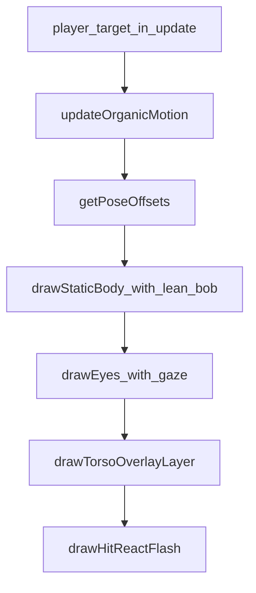

# Architecture Documentation

## Project Structure

### Modular Architecture (ES6 Modules)
The game has been refactored into a modular ES6 architecture:
- `zombie-game.html`: Entry point and structure
- `css/style.css`: Visual styling
- `js/main.js`: Main game loop and initialization (entry point)
- `js/core/`: Core game systems (constants, canvas, game state, WebGPU renderer, ZombobsFX)
- `js/companions/`: AI NPC companion system (CompanionSystem)
- `js/entities/`: Game entity classes (Bullet, Zombie, Particle, etc.)
- `js/systems/`: Game systems (Audio, Graphics, Particle, Settings, Input)
- `js/ui/`: User interface components (HUD, Settings Panel, LeaderboardDisplay, RankDisplay, BossHealthBar)
- `js/utils/`: Utility functions (combat, game utilities, array operations)

This modular structure improves maintainability, testability, and scalability.

### Backend Server (`LOCAL_SERVER/`)
- `server.js`: Express + socket.io server
  - Serves static files from project root
  - Socket.io WebSocket server for multiplayer
  - Default port: 3000 (configurable via PORT env var)
- `package.json`: Node.js dependencies (Express, socket.io)
- `launch.ps1`: Styled PowerShell launcher script with enhanced monitoring
  - System stats taskbar (RAM, CPU, Backend RAM, Uptime, Time, Port)
  - Backend RAM monitoring tracks Node.js process memory usage
  - Automatic dependency installation

### Production Server (`huggingface-space-SERVER/`)
- `server.js`: Express + socket.io server for Hugging Face Spaces deployment
  - Socket.io WebSocket server for multiplayer
  - Global highscore leaderboard system with **MongoDB persistence** and in-memory caching
    - MongoDB connection for persistent score storage (optional, falls back to in-memory if unavailable)
    - `highscoresCache`: Global variable loaded on server start from MongoDB
    - `GET /api/highscores`: Returns cached data instantly (no DB query per request)
    - `POST /api/highscore`: Updates cache immediately, saves to MongoDB asynchronously
    - Graceful fallback to in-memory cache if MongoDB unavailable
    - **See [MongoDB Documentation](./MONGODB.md) for detailed setup and architecture**
  - **Chat System**: Real-time lobby chat with rate limiting and sanitization
    - Circular buffer storage (max 50 messages)
    - Rate limiting: 5 messages per 10 seconds per player
    - Message sanitization: HTML entity encoding, XSS prevention
    - Socket.IO events: `chat:message`, `chat:message:new`, `chat:history`, `chat:rateLimit`, `chat:error`
  - HTTP API endpoints for score submission and leaderboard retrieval
  - Cookie-based user session tracking (`zombobs_user_id`)
  - Performance optimizations (compression, circular buffers, efficient leader tracking)
  - Default port: 7860 (Hugging Face Spaces standard, configurable via PORT env var)
- `package.json`: Node.js dependencies (Express, socket.io, cookie-parser, compression, mongodb)
- `Dockerfile`: Container configuration for Hugging Face Spaces deployment
- **MongoDB Integration**: Persistent highscore storage (optional, falls back to in-memory if unavailable)
  - Connection string via `MONGO_URI` or `MONGODB_URI` environment variable
  - Database: `zombobs`, Collection: `highscores`
  - Indexed on `score` field for fast queries
  - Loaded into memory cache on server startup
  - Updated asynchronously when new scores are submitted
  - Graceful fallback to in-memory cache if MongoDB unavailable
- `launch.bat`: Windows batch file that calls PowerShell wrapper

## Module Structure

### Core Modules (`js/core/`)

#### constants.js
**Purpose**: Centralized game constants and configuration

**Exports**:
- `RENDER_SCALE` - Canvas render scale
- `WEAPONS` - Weapon definitions (pistol, shotgun, rifle, flamethrower)
- `PLAYER_MAX_HEALTH`, `PLAYER_BASE_SPEED`, `PLAYER_SPRINT_SPEED` - Player stats
- `MELEE_RANGE`, `MELEE_DAMAGE`, `MELEE_COOLDOWN` - Melee settings
- `GRENADE_...` - Grenade settings
- `..._PICKUP_...` - Pickup settings
- `WAVE_BREAK_DURATION` - Wave timing
- `MAX_PARTICLES` - Particle system limit
- `RENDERING` - Rendering performance constants object
  - Alpha values (GROUND_PATTERN_ALPHA, VIGNETTE_ALPHA, DAMAGE_INDICATOR_ALPHA, SHADOW_ALPHA)
  - Timing constants (ZOMBIE_PULSE_PERIOD, BURN_TICK_INTERVAL, zombie pulse periods)
  - Viewport culling (CULL_MARGIN)
  - Cache thresholds (CANVAS_SIZE_CHANGE_THRESHOLD, PLAYER_POSITION_CHANGE_THRESHOLD)

#### canvas.js
**Purpose**: Canvas initialization and management

**Exports**:
- `canvas` - Canvas DOM element
- `ctx` - Canvas 2D rendering context
- `gpuCanvas` - WebGPU canvas element used by the GPU renderer
- `resizeCanvas(player)` - Resize canvas to fit window
- `applyTextRenderingQuality(context, quality)` - Apply text rendering quality to a canvas context
- `applyTextRenderingQualityToAll()` - Apply text rendering quality to all canvas contexts

**Text Rendering Quality System**:
- Applies font smoothing settings (low, medium, high) to all canvas contexts
- `applyTextRenderingQualityToAll()` updates: main canvas, GameHUD, RankDisplay, LeaderboardDisplay, SettingsPanel, ProfileScreen, AchievementScreen, BattlepassScreen, BadgeScreen, BossHealthBar
- Change listener in `js/main.js` calls `applyTextRenderingQualityToAll()` when `textRenderingQuality` setting changes
- Settings persist via SettingsManager and localStorage

**Dependencies**: `constants.js`, `systems/SettingsManager.js`

#### WebGPURenderer.js
**Purpose**: GPU-accelerated background rendering and compute-driven particles

**Responsibilities**:
- Initialize WebGPU device/context and configure preferred canvas format
- Maintain a uniform buffer for time, resolution, bloom intensity, distortion toggle, and lighting quality level
- Render a full-screen procedural background with noise/fog/vignette and optional distortion and rim lighting
- Update particles via a compute shader and render them with a point-list pipeline
- **ZombobsFX Integration**: 100k particle spore cloud effect with mouse repulsion (above background, below game entities)
- Gracefully fall back to Canvas 2D if WebGPU is unavailable
- **Performance**: Dirty flag system for efficient uniform buffer updates

**Runtime Controls**:
- `setBloomIntensity(value)` — 0.0–1.0 (marks uniforms dirty when changed)
- `setDistortionEffects(enabled)` — boolean (marks uniforms dirty when changed)
- `setLightingQuality(level)` — `off` | `simple` | `advanced` (marks uniforms dirty when changed)
- `setParticleCount(level)` — `low` (CPU/off) | `high` (10k) | `ultra` (50k) (optimized buffer reuse)
- `setZombobsFXEnabled(enabled)` — boolean (toggles 100k particle spore cloud effect)
- `static isWebGPUAvailable()` — Consolidated WebGPU availability check

**ZombobsFX Spore Cloud Effect**:
- **100k Particles**: GPU-accelerated compute shader updates all particles
- **Mouse Interaction**: Particles repel from cursor position (normalized -1 to 1 coordinates)
- **Color Gradient**: Zombie Purple to Toxic Green based on particle life
- **Additive Blending**: Creates glowing "radioactive core" effect when particles overlap
- **Render Order**: Renders after background shader, before game particles
- **Settings**: Toggleable via `video.zombobsFXEnabled` (default: true)
- **Integration**: Uses shared WebGPU device/context from WebGPURenderer (no duplicate initialization)
- **Location**: `js/core/ZombobsFX.js` - Integrated into `WebGPURenderer.render()`

**Intensity Adjustment Parameters** (in `js/core/ZombobsFX.js`):
- **Particle Count** (`this.numParticles`): Default 100,000. Range: 10,000-200,000. More = denser cloud (higher performance cost)
- **Particle Size** (vertex shader line ~132): Default 0.008. Range: 0.005-0.015. Larger = more visible particles
- **Repel Strength** (`updateCompute()` line ~294): Default 2.0. Range: 1.0-5.0. Higher = stronger mouse repulsion
- **Alpha Multiplier** (vertex shader line ~143): Default 0.8. Range: 0.5-1.0. Higher = more opaque particles
- **Flow Speed** (compute shader line ~78): Default 0.002. Range: 0.001-0.005. Higher = faster particle movement
- **Repel Distance** (compute shader line ~86): Default 0.3. Range: 0.2-0.5. Larger = bigger mouse interaction area
- **Repel Force Multiplier** (compute shader line ~89): Default 0.05. Range: 0.02-0.1. Higher = stronger repulsion force

All adjustment points are marked with `// ADJUSTMENT:` comments in the code for easy finding.

**Game Particle Sync** (`syncGameParticles()`):
- Syncs Canvas 2D particles (explosions, blood splatter, etc.) to WebGPU for enhanced rendering
- Particles rendered as quads (4 vertices each) with circular alpha falloff in fragment shader
- **Color Parsing**: Supports `rgb(...)`, `rgba(...)`, and `#hex` formats
  - **Important**: Color parser checks `startsWith('rgb')` to handle both `rgb` and `rgba` formats
  - Unparsed colors default to white (r=1.0, g=1.0, b=1.0), which can cause visual artifacts
  - Particles are 8x larger in WebGPU (minimum 10px) for better visibility
- Renders in world space with camera offset applied in vertex shader
- Location: `js/core/WebGPURenderer.js` - `syncGameParticles()` method

**Performance Features**:
- **Dirty Flag System**: Only writes to uniform buffer when values actually change
- **Buffer Reuse**: Particle buffers reused when count doesn't change, only recreated when size increases
- **Error Handling**: Graceful fallback to Canvas 2D on render errors
- **Bind Group Caching**: Efficient bind group management with `_createParticleBindGroups()` helper
- **ZombobsFX**: Shared device/context eliminates duplicate WebGPU initialization overhead

**Integration**:
- Reads settings from `SettingsManager` via `js/main.js` and applies changes live
- Respects `video.webgpuEnabled` and only renders when enabled and available
- Consolidated checks via `isWebGPUActive()` helper in main.js
- ZombobsFX initialized during WebGPURenderer.init() and rendered in render() loop

#### ZombobsFX.js
**Purpose**: 100k particle spore cloud background effect with mouse interaction

**Exports**:
- `ZombobsFX` class - Spore cloud particle effect system

**Methods**:
- `async init(device, context, format, canvas)` - Initialize with existing WebGPU device/context
- `setupInput()` - Setup mouse move listener for cursor tracking
- `render(commandEncoder, renderPass, dt)` - Render compute and draw passes (called from WebGPURenderer)
- `isReady()` - Check if effect is initialized and ready to render

**Features**:
- **100k Particles**: GPU-accelerated compute shader updates all particles per frame
- **Mouse Repulsion**: Particles repel from cursor position (normalized -1 to 1 coordinates)
- **Color Gradient**: Zombie Purple to Toxic Green based on particle life
- **Additive Blending**: Creates glowing "radioactive core" effect when particles overlap
- **Double Buffering**: Ping-pong particle buffers for compute shader updates
- **Separate Bind Groups**: Compute uses read_write storage, render uses read-only storage
- **Shader Groups**: Compute shader uses `@group(0)`, render uses `@group(1)`

**Integration**:
- Uses shared WebGPU device/context from WebGPURenderer (no duplicate initialization)
- Renders in WebGPURenderer.render() after background shader, before game particles
- Toggleable via `video.zombobsFXEnabled` setting (default: true)
- Settings applied in real-time via `webgpuRenderer.setZombobsFXEnabled()`

**Dependencies**: `core/canvas.js` (for canvas reference), WebGPU device/context from WebGPURenderer

#### gameState.js
**Purpose**: Centralized game state management

**Exports**:
- `gameState` - Main state object containing all game variables
- `resetGameState(canvasWidth, canvasHeight)` - Reset game to initial state

**Game State Properties**:
- `gameTime` - Day/night cycle position (0 to 1)
- `dayNightCycle` - Cycle configuration (duration, startTime)
- `isNight` - Boolean flag for night time
- `acidProjectiles[]` - Active acid projectiles
- `acidPools[]` - Active acid pool hazards
- `gameStartTime` - Timestamp when current game session started (for scoreboard time tracking)
- `showProfile` - Profile screen visibility flag
- `showAchievements` - Achievement screen visibility flag
- `showBattlepass` - Battlepass screen visibility flag
    - `showBadges` - Badge screen visibility flag
- `pickupsCollected` - Total pickups gathered in the current session (v0.8.3.5)
- `headshots` - Total headshots (upper-body hits) in the current session (v0.8.3.5)
- `achievementNotifications[]` - Array of achievement notifications to display
    - `sessionResults` - Session results from profile system (rank XP, achievements, badges, battlepass progress)

**Dependencies**: `constants.js`

#### rankConstants.js
**Purpose**: Rank system constants and progression formulas

**Exports**:
- `RANK_NAMES` - Array of rank names in progression order
- `TIERS_PER_RANK` - Number of tiers per rank (5)
- `RANK_XP_BASE_REQUIREMENT` - Base XP for first tier (100)
- `RANK_XP_SCALING_FACTOR` - XP scaling factor per tier (1.15)
- `SCORE_TO_RANK_XP_RATE` - Score to rank XP conversion rate (0.1)
- `WAVE_COMPLETION_BONUS` - Rank XP per wave completed (10)
- `getRankXPRequirement(rank, tier)` - Calculate XP required for rank/tier
- `getRankName(rank)` - Get rank name by rank number
- `getTotalRankXPForRank(rank, tier)` - Get total XP needed for rank/tier
- `getRankFromXP(totalRankXP)` - Calculate rank/tier from total XP

**Dependencies**: None

#### achievementDefinitions.js
**Purpose**: Achievement definitions and helper functions

**Exports**:
- `ACHIEVEMENT_DEFINITIONS` - Array of all achievement definitions (30+ achievements)
- `getAchievementById(id)` - Get achievement by ID
- `getAchievementsByCategory(category)` - Filter achievements by category
- `getAchievementCategories()` - Get all achievement categories

**Achievement Categories**:
- Combat: Kill milestones, headshots, combos
- Survival: Wave milestones, time survived, perfect waves
- Collection: Weapon master, skill collector, pickup hoarder
- Skill: Accuracy, efficiency challenges
- Social: Co-op wins, games played milestones

**Dependencies**: None

#### badgeDefinitions.js
**Purpose**: Badge definitions and helper functions

**Exports**:
- `BADGE_DEFINITIONS` - Array of all badge definitions (6 badges)
- `getBadgeById(id)` - Get badge by ID
- `getAllBadgeDefinitions()` - Get all badge definitions

**Badge Types**:
- `rank_2` - Reach rank 2
- `first_kill` - Get 1 kill
- `profile_visitor` - Check your profile
- `first_game` - Play first game
- `wave_5` - Survive wave 5
- `kill_10` - Get 10 kills

#### battlepassDefinitions.js
**Purpose**: Battlepass season and tier definitions

**Exports**:
- `BATTLEPASS_SEASON_1` - Season 1 battlepass definition (50 tiers)
- `BATTLEPASS_XP_PER_TIER` - Base XP per tier (100)
- `BATTLEPASS_XP_SCALING` - XP scaling factor (1.1)
- `getBattlepassXPRequirement(tier)` - Calculate XP required for tier
- `getCurrentSeason()` - Get current active season
- `isSeasonActive(season)` - Check if season is currently active
- `getDaysRemaining(season)` - Get days remaining in season

**Dependencies**: None

### Entity Modules (`js/entities/`)

#### Bullet.js
**Purpose**: Bullet projectile classes

**Exports**: `Bullet` class, `FlameBullet` class

**Methods**:
- `update()` - Move bullet (flame bullets slow down over time)
- `draw()` - Render bullet with visual trail (flame bullets have orange/red gradient)
- `isOffScreen(canvasWidth, canvasHeight)` - Boundary check

**Features**:
- Visual trail rendering based on velocity
- Weapon-specific damage (can be modified by damage multiplier)
- **FlameBullet**: Short-lived flame particles with dissipating velocity, applies burn effect on hit

**Dependencies**: `core/canvas.js`

#### Zombie.js
**Purpose**: Zombie enemy classes

**Exports**: `Zombie` (base), `NormalZombie`, `FastZombie`, `ExplodingZombie`, `ArmoredZombie`, `GhostZombie`, `SpitterZombie`, `FlyingZombie`, `BlightZombie`, `CrawlerZombie`

**Zombie Variants**:
- **NormalZombie**: Default enemy type with **8 randomized visual variants**:
  - **Classic**: Standard green zombie (original look)
  - **Decayed**: Darker rotted appearance with exposed bone and scars
  - **Freshly Turned**: Human-like coloring with bloody t-shirt
  - **Office Worker**: Corporate zombie with torn suit, tie, and broken glasses
  - **Punk**: Edgy zombie with vest, metal studs, and mohawk
  - **Nurse**: Hospital zombie with scrubs, nurse cap with red cross, and blood stains
  - **Construction Worker**: Hardhat, orange safety vest with reflective stripes
  - **Soldier**: Military fatigues with camo pattern and army helmet
  - Each variant has unique: skin colors, clothing, accessories, scars, and blood stains.
  - **Animations (v0.8.3.1)**: Procedural sinusoidal walking feet, dual swaying arms, and cohesive colored sleeves matching the outfit (visible hands).
  - [AMENDED 2026-06-25]: Feet/arm sway now driven by per-zombie `walkPhase` (desynced via `animSeed`) instead of global `Date.now()` — zombies no longer shuffle in sync.
- **Torso Overlay VFX (2026-06-25)**: Additive clipped layers on upright zombie torsos (~70% spawn rate, deterministic from `id`). Types: `goreWetness`, `decayMold`, `tornRemnants`, `infectionPulse`, `slimeFilm`. Drawn above flesh ellipse, below arms/head. Skipped on ghost/blight/crawler/flying.
- **Organic Motion System (2026-06-25)**: Cosmetic animation state on base `Zombie` — no multiplayer sync or combat changes.



| Method | Purpose |
|--------|---------|
| `updateOrganicMotion(player, dx, dy, dist)` | Smooth gaze, advance `walkPhase`, body lean, micro-behavior timer |
| `getMotionProfile()` | Per-type tuning (lean/bob/sway/tremor scales); overridden by fast/armored/exploding/spitter |
| `getPoseOffsets()` | Lean, bob, arm sway/reach, hit recoil, tremor offsets |
| `getDrawPosition()` | Applies pose to render coordinates |
| `drawEyes(ctx, x, y, radius)` | Gaze-offset pupil glow; quality-gated via `eyeGlow` preset |
| `drawHitReactFlash(ctx, x, y, radius)` | Brief additive damage flash (~180ms) |
| `drawTorsoOverlayLayer(ctx, x, y, radius)` | Additive torso detail VFX |

**Per-zombie animation fields**: `animSeed`, `gazeX`, `gazeY`, `bodyLean`, `facingAngle`, `walkPhase`, `armSwayOffset`, `hitReactUntil`, `behaviorState`, `behaviorUntil`, `torsoOverlay`, `torsoShape`

**Micro-behaviors** (pose-only): `lurch`, `stagger`, `hesitate`, `reach`, `chase` — cosmetic; do not alter `speed` or AI pathfinding.

- **FastZombie**: 1.6x speed, 60% health, smaller hitbox, reddish/orange visuals; aggressive forward lean (`leanScale: 1.45`)
- **ExplodingZombie**: Explodes on death, AOE damage, orange/yellow pulsing glow; danger tremor scales up below 50% HP
- **ArmoredZombie**: Slower, heavily armored, absorbs damage before health; heavy/slow bob motion profile
- **GhostZombie**: Semi-transparent (50% opacity), 1.3x speed, spectral blue/white, wobble animation
- **SpitterZombie**: Ranged enemy with kiting AI, fires acid projectiles, toxic green appearance, throat/torso acid pulse, Wave 6+
- **FlyingZombie**: Flies with wings, 1.2x speed, 70% health, smaller hitbox, subtle floating animation, Wave 5+
- **BlightZombie**: Fungal support zombie, 0.75x speed, 1.3x health (tanky), 1.1x radius. Leaves toxic slime trail (acid pools every 900ms, smaller radius, lower damage). Explodes into a damaging spore cloud on death (70px radius, 20 AOE damage) plus a lingering slime pool. Deep purple/magenta appearance with mushroom growths and pulsing fungal nodules, Wave 7+
- **CrawlerZombie**: Low-profile crawler, 1.3x speed, 60% health, 0.7x radius (smaller hitbox), dark brown/gray appearance, crawling pose, Wave 4+

**Methods**:
- `update(player)` - AI pathfinding (kiting for SpitterZombie, slime trail dropping for BlightZombie); calls `updateOrganicMotion()` for gaze/pose state
- `drawStaticBody(ctx, x, y, radius, pose)` - Layered body render (torso → overlay → limbs → head)
- `draw()` - Aura, posed body, hit flash, gaze eyes, health bar
  - Health bar rendering with configurable styles (gradient, solid, simple)
  - Health bar shown for 2 seconds after taking damage (if enabled)
  - Style controlled by `enemyHealthBarStyle` setting
- `drawNameTag(context, yOffset)` - Renders a color-coded type label pill above the zombie
  - Display names: Zombie, Runner, Tank, Bomber, Ghost, Spitter, Flyer, Blight, Crawler, BOSS
  - Each type has a unique color matching its visual theme
  - Controlled by `video.enemyNameTags` setting (default: on)
  - Called automatically by `EntityRenderSystem` post-draw hook (no per-subclass integration needed)
- `takeDamage(bulletDamage)` - Damage handling

**Burning State** (Base Zombie):
- `burnTimer` - Milliseconds remaining for burn effect
- `burnDamage` - Damage per tick (200ms intervals)
- Fire particles spawn while burning

**Dependencies**: `core/canvas.js`, `core/gameState.js`, `systems/*`

#### Particle.js
**Purpose**: Particle effects and damage numbers

**Exports**: `Particle` class, `DamageNumber` class

**Dependencies**: `core/canvas.js`

#### Pickup.js
**Purpose**: Pickup and power-up classes

**Exports**: `HealthPickup`, `AmmoPickup`, `DamagePickup`, `NukePickup`

**Pickup Types**:
- **HealthPickup**: Red cross icon, restores player health
- **AmmoPickup**: Yellow/orange bullet icon, restores ammo and grenades
- **DamagePickup**: Purple "2x" icon, doubles weapon damage for 10 seconds
- **NukePickup**: Yellow/black radiation symbol, instantly kills all active zombies

**Dependencies**: `core/canvas.js`

#### Grenade.js
**Purpose**: Grenade projectile class

**Exports**: `Grenade` class

**Dependencies**: `core/canvas.js`, `core/gameState.js`, `core/constants.js`, `utils/combatUtils.js`

#### Shell.js
**Purpose**: Shell casing class

**Exports**: `Shell` class

**Dependencies**: `core/canvas.js`

#### AcidProjectile.js
**Purpose**: Acid projectile from Spitter Zombie

**Exports**: `AcidProjectile` class

**Methods**:
- `update()` - Move toward target position
- `draw()` - Render toxic green projectile with trail
- `land()` - Create acid pool at impact location
- `isOffScreen(canvasWidth, canvasHeight)` - Boundary check

**Features**:
- Targets player position at time of firing
- Creates `AcidPool` on impact (within 20px tolerance)
- Toxic green visual with glow effect

**Dependencies**: `core/canvas.js`, `core/gameState.js`, `entities/AcidPool.js` (via global reference)

#### AcidPool.js
**Purpose**: Ground hazard that damages players

**Exports**: `AcidPool` class

**Methods**:
- `update()` - Damage players standing in pool, decrement lifetime
- `draw()` - Render bubbling acid pool with fade-out
- `isExpired()` - Check if pool has expired (5 second duration)

**Features**:
- Damages players every 200ms while standing in pool (0.3 damage per tick)
- Respects shield before health
- Animated bubbling effect
- Fades out over 5 second lifetime

**Dependencies**: `core/canvas.js`, `core/gameState.js`, `utils/gameUtils.js` (via global reference)

#### Prop.js (v0.8.1.7+)
**Purpose**: World prop entity class (rocks, debris, burnt cars, skulls, zombie parts, fire trash cans) for single player arcade mode

**Exports**: `Prop` class

**Properties**:
- `x, y` - Position
- `type` - Prop type ('rock', 'debris', 'burntCar', 'skull', 'zombieArms', 'zombieLegs', 'trashCan')
- `width, height` - Dimensions (varies by type)
- `rotation` - Random rotation angle
- `radius` - Collision radius (circular bounds)
- `color, outlineColor` - Visual properties
- `smokeParticles[]` - Smoke particle array (burntCar only)
- `fireParticles[]` - Fire particle array (burntCar and trashCan)
- `lastUpdateTime` - Timestamp for particle updates (burntCar and trashCan)
- `armCount` - Number of arms (zombieArms only, 2-3)
- `armRotations[]` - Stored rotation angles for each arm (zombieArms only)
- `armDecayMarks[]` - Stored decay mark positions for each arm (zombieArms only)
- `legRotations[]` - Stored rotation angles for each leg (zombieLegs only)
- `legDecayMarks[]` - Stored decay mark positions for each leg (zombieLegs only)
- `textureMarks[]` - Stored bone texture mark positions (skull only, 4 marks)
- `dents[]` - Stored dent positions and sizes (trashCan only, 2-3 dents)
- `lidOpenAngle` - Lid opening angle in radians (trashCan only, 0.3-0.5)

**Methods**:
- `draw()` - Render the prop on canvas
- `update()` - Update smoke and fire particles for burntCar and trashCan props
- `initSmokeParticles()` - Initialize smoke particles for burnt car
- `initFireParticles()` - Initialize fire particles for burnt car
- `initTrashCanFireParticles()` - Initialize fire particles for trash can (3-5 particles from top center)
- `initTrashCanDetails()` - Initialize static details for trash can (dents, lid angle)
- `updateBurntCarParticles()` - Update burnt car smoke and fire particles
- `updateTrashCanFireParticles()` - Update trash can fire particles with flickering
- `drawRock()` - Render rock prop (irregular ellipse shape)
- `drawDebris()` - Render debris prop (rectangular with detail lines)
- `drawBurntCar()` - Render burnt car prop with enhanced details, animated smoke, and fire effects
- `drawSkull()` - Render zombie skull prop with enhanced anatomical detail and glow effects
- `drawZombieArms()` - Render severed zombie arms prop (2-3 arms with bone ends)
- `drawZombieLegs()` - Render severed zombie legs prop (2 legs with bone ends)
- `drawTrashCan()` - Render fire trash can prop with 2.5D/3D perspective and animated fire

**Prop Types**:
- **Rock**: 20-35px, gray colors, irregular ellipse shape
- **Debris**: 15-35px, darker gray, rectangular with detail lines
- **Burnt Car**: 60-90px width, 80-120px height, black colors, enhanced car shape with hood details, door lines, window frames, wheel rims, charred texture, animated smoke particles (3-5 per car), and flickering fire particles (4-7 per car)
- **Skull**: 25-35px, bone white (#e8e8e8) with dark cracks (#4a4a4a), enhanced oval shape with detailed eye sockets, nasal cavity, jaw line with 6 teeth, 5 crack lines, cheekbone definition, bone texture marks, and glow effects (outer glow, inner eye socket glow, shadow)
- **Zombie Arms**: 20-30px width, 40-60px height, decayed flesh (#8b7355) with bone (#d4c5a9), 2-3 arms with visible bone ends and decay marks
- **Zombie Legs**: 25-35px width, 50-70px height, decayed flesh (#8b7355) with bone (#d4c5a9), 2 legs with visible bone ends and decay marks
- **Trash Can**: 30-40px width, 35-45px height, dark green metal (#2d5016) with lighter highlights (#4a6a2f), 2.5D/3D cylindrical rendering with perspective (top and bottom ellipses), metal bands, rims, slightly open lid, dents/scratches, and animated fire particles (3-5 particles rising from top opening with flickering effect)

**Smoke Particle System** (burntCar only):
- Each burnt car has 3-5 smoke particles
- Particles rise upward (0.5-1px per frame) with horizontal drift (-0.2 to 0.2px)
- Particles fade from 0.6 to 0 opacity over 2-4 second lifetime
- Particles respawn at car position when expired
- White/gray gradient with radial fade-out effect

**Fire Particle System** (burntCar and trashCan):
- **Burnt Car**: 4-7 fire particles spawning from windows (40% left, 40% right) and engine/hood area (20%)
- **Trash Can**: 3-5 fire particles spawning from top center opening
- Fire colors: orange/yellow/red variations (#ff6600, #ff8800, #ffaa00, #ffff00, #ff4400, #ff0000)
- Particles rise upward (0.8-1.4px per frame for cars, 0.8-1.2px for trash cans) with horizontal drift
- Flickering effect using sine wave for opacity and size variation
- Particles fade over 1-2 second lifetime (shorter than smoke)
- Particles respawn at original spawn locations when expired
- Rendered with `screen` composite mode for additive glow effect
- Radial gradient from bright center to transparent edges

**Dependencies**: `core/canvas.js`

### System Modules (`js/systems/`)

#### AudioSystem.js
**Purpose**: Web Audio API sound generation

**Exports**:
- `initAudio()` - Initialize audio context
- `getMasterGainNode()` - Get master volume control
- `playGunshotSound()` - Play gunshot
- `playDamageSound()` - Play damage sound
- `playKillSound()` - Play kill sound
- `playFootstepSound()` - Play footstep
- `playExplosionSound()` - Play explosion
- `playRestartSound()` - Play restart sound

**Dependencies**: `systems/SettingsManager.js`

#### GraphicsSystem.js
**Purpose**: Graphics utilities, texture loading, and quality scaling system

**Exports**:
- `initGroundPattern()` - Load and cache ground texture pattern (renamed from `initGrassPattern`)
- `graphicsSettings` - Getter object for video settings (quality, maxParticles, vignette, shadows, lighting, effectIntensity, postProcessingQuality, particleDetail)
- `getQualityMultipliers()` - Returns quality-based multipliers (glow, size, detail, opacity) based on preset
- `getQualityValues(effectType)` - Returns quality-specific values for visual effects (eyeGlow, muzzleFlash, explosion, aura, damageNumber)

**Dependencies**: `core/canvas.js`, `systems/SettingsManager.js`

**Quality Scaling System**:
- **Quality Presets**: Low, Medium, High, Ultra, Custom
  - Low: Minimal effects (0.3-0.5x multipliers), basic visuals, performance-focused
  - Medium: Balanced effects (0.7-0.75x multipliers), some detail
  - High: Rich effects (1.0x multipliers), good detail
  - Ultra: Maximum effects (1.2-1.5x multipliers), cinematic quality
- **Effect Intensity**: Multiplier (0.0-2.0) applied to all quality-based effects
- **Quality Values**: Effect-specific quality scaling
  - Eye Glows: Shadow blur (4px Low → 18px Ultra), gradient stops (3-5)
  - Muzzle Flash: Size multiplier (0.5x Low → 1.2x Ultra), gradient layers (1-3), trails
  - Explosions: Particle counts, large flash, shockwave rings, trails
  - Auras: Opacity (20% Low → 80% Ultra), pulse complexity, multi-layer
  - Damage Numbers: Font size, outline quality, glow intensity

**Notes**:
- Loads ground texture from `sample_assets/tiles/bloody_dark_floor.png`
- Creates tiling pattern for canvas background
- Replaces previous procedural grass generation
- Ground pattern opacity set to 0.6 for better visibility
- Provides reactive getters for video settings that check SettingsManager
- Used throughout rendering pipeline for conditional effect rendering
- Centralized quality scaling logic ensures consistent quality differentiation

#### RenderingCache.js
**Purpose**: Intelligent caching system for expensive rendering operations

**Exports**:
- `RenderingCache` class - Caching system for gradients and patterns
- `renderingCache` singleton instance

**Methods**:
- `needsInvalidation(player)` - Check if cache needs invalidation based on canvas size/player position
- `invalidate(player)` - Invalidate cache and update cached values
- `getBackgroundGradient()` - Get or create cached background gradient
- `getVignetteGradient()` - Get or create cached vignette gradient
- `getLightingGradient(player)` - Get or create cached lighting gradient (position-dependent)
- `getGroundPattern()` - Get or create cached ground pattern
- `updateSettings(vignetteEnabled, lightingEnabled)` - Update settings cache

**Dependencies**: `core/canvas.js`, `core/constants.js`, `systems/GraphicsSystem.js`

**Performance Features**:
- Caches gradients until canvas size changes >10px threshold
- Caches lighting gradient until player moves >50px threshold
- Reduces expensive gradient creation from every frame to only when needed
- Settings-aware caching to avoid redundant recreation

#### PlayerRenderer.js
**Purpose**: Enhanced player model rendering with 4-directional views and round hands

**Exports**:
- `drawEnhancedPlayer(player, isFiring)` - Draw enhanced player model
- `getPlayerDirection(player)` - Get current facing direction as string
- `DIRECTION` - Direction constants (DOWN, UP, LEFT, RIGHT)
- `getDirectionFromAngle(angle)` - Convert angle to direction constant

**Features**:
- **4-Directional Facing**: Player faces up, down, left, or right based on aim angle
- **Humanoid Body**: Head, torso, arms instead of simple circle
- **Round Hands**: Visible skin-toned hands for gun holding
- **Military Headgear**: Helmet/cap matching player color
- **Face Details**: Eyes, mouth, nose based on direction
- **Proper Layering**: Draw order based on direction for correct occlusion

**Direction Mapping**:
- `RIGHT` (0): 315° to 45° - Facing right
- `DOWN` (1): 45° to 135° - Facing screen (front view)
- `LEFT` (2): 135° to 225° - Facing left
- `UP` (3): 225° to 315° - Facing away (back view)

**Dependencies**: `core/canvas.js`, `systems/SettingsManager.js`, `systems/GraphicsSystem.js`


#### ParticleSystem.js
**Purpose**: Particle effects and blood splatter with quality scaling

**Exports**:
- `addParticle(particle)` - Add particle to system
- `createParticles(x, y, color, count)` - Create particle burst (quality-aware)
- `createBloodSplatter(x, y, angle, isKill)` - Create blood effect (quality-scaled)
- `createExplosion(x, y)` - Create explosion visual (quality-scaled)
- `updateParticles()` - Update all particles (optimized with filter pattern)
- `drawParticles()` - Render all particles (quality-aware rendering)
- `spawnParticle(x, y, color, props)` - Spawn particle using object pool (respects limits)

**Dependencies**: `core/gameState.js`, `entities/Particle.js`, `core/constants.js`, `utils/ObjectPool.js`, `systems/GraphicsSystem.js`

**Quality Features**:
- **Quality-Based Limits**: Particle count enforced based on quality preset (50/100/200/500)
- **Quality-Aware Spawning**: Early returns prevent spawning at limit
- **Quality-Scaled Effects**: Explosions and blood splatter scale particle counts by quality
  - Explosions: 15-40 fire particles, 8-20 smoke particles, shockwave rings at Ultra
  - Blood Splatter: 60-150% particle counts, color variation, pooling effects at Ultra
- **Particle Detail**: Rendering quality controlled by particleDetail setting
  - Minimal: Simple solid circles
  - Standard: Current particle system
  - Detailed: Gradients and light glow
  - Ultra: Multi-layer gradients, glow, enhanced effects

**Performance Features**:
- **Object Pooling**: Uses `ObjectPool` for efficient particle reuse
- **Optimized Update Loop**: Replaced reverse loop + splice with efficient filter pattern
- **Memory Management**: Particles returned to pool when expired
- **Quality-Based Culling**: Reduces particle counts at lower quality settings

#### BloodSimulationSystem.js
**Purpose**: GPU-accelerated volumetric blood simulation with real-time fluid dynamics

**Exports**:
- `BloodSimulationSystem` class - Blood simulation system
- `bloodSimulationSystem` singleton - Global blood simulation instance

**Methods**:
- `init()` - Initialize blood simulation system
- `update(deltaTime)` - Update blood physics simulation (CPU fallback)
- `addBlood(worldX, worldY, amount)` - Spawn blood at world coordinates
- `getBloodData()` - Get active blood cells for rendering
- `clear()` - Clear all blood from simulation
- `getDebugInfo()` - Get debug information (grid size, active cells, performance)

**Dependencies**: `systems/SettingsManager.js`, `systems/GraphicsSystem.js`

**Quality Features**:
- **Low/Medium**: Disabled (uses particle splatter only, no blood grid)
- **High**: 64x64 grid, 10px cells, 30fps update rate (optimized for performance)
- **Ultra**: 128x128 grid, 5px cells, 60fps update rate (maximum detail)
- **Gore Scaling**: Blood amount scaled by `bloodGoreLevel` setting (0.0-1.0)
- **Quality-Aware**: Automatically adjusts grid size and update frequency

**Physics Simulation**:
- **Fluid Dynamics**: Cellular automata + Navier-Stokes approximation
- **Neighbor Averaging**: 4-neighbor pressure gradient calculation
- **Viscosity**: Thick blood physics with damping (fresh = 0.8, dried = 0.2)
- **Evaporation**: Blood height *= 0.998 per frame, viscosity *= 0.999
- **Pressure Flow**: Blood flows from high pressure to low pressure areas
- **World-Space Wrapping**: Grid wraps using modulo for infinite tiling

**Performance Features**:
- **Throttled Updates**: 16ms (Ultra) or 32ms (High) intervals to prevent frame drops
- **Spawn Queue**: Asynchronous blood spawning processed in batches
- **Active Cell Filtering**: Only non-empty cells (height \u003e 0.01) returned for rendering
- **Grid Reuse**: Blood grid persists between frames for efficient simulation
- **Memory Efficient**: Dynamic grid allocation based on quality preset
- **CPU Fallback**: Full physics simulation when WebGPU unavailable

**Coordinate System**:
- **World Space**: Blood positions in unlimited world coordinates
- **Grid Mapping**: `worldToGridIndex(x, y)` converts world → grid cell
- **Modulo Wrapping**: Negative coordinates wrapped using modulo arithmetic
- **Cell Size**: 5px (Ultra) or 10px (High) per grid cell

**Future WebGPU Integration** (Planned):
- Compute shader blood simulation (1000x faster than CPU)
- Height-mapped volumetric rendering with normal maps
- Specular highlights for wet blood surface
- Blood trails flowing downhill with terrain detection
- Gameplay mechanics: Blood pools slow zombies by 20%

#### SettingsManager.js
**Purpose**: Settings persistence and management

**Exports**: `SettingsManager` class, `settingsManager` singleton

**Methods**:
- `loadSettings()` - Load from localStorage
- `saveSettings()` - Save to localStorage
- `getSetting(category, key)` - Get setting value
- `setSetting(category, key, value)` - Set setting value
- `applyVideoPreset(preset)` - Apply quality preset (low/medium/high/custom)
- `addChangeListener(callback)` - Register callback for setting changes
- `removeChangeListener(callback)` - Unregister callback

**New Visual Settings (V0.7.0+)**:
- `video.textRenderingQuality` - Text rendering quality ('low', 'medium', 'high')
  - Controls `imageSmoothingEnabled` and `imageSmoothingQuality` on all canvas contexts
  - Applied globally via `applyTextRenderingQualityToAll()` function
- `video.rankBadgeSize` - Rank badge size ('small', 'normal', 'large')
  - Size multipliers: small 0.8x, normal 1.0x, large 1.2x
- `video.showRankBadge` - Show/hide rank badge on main menu (boolean)
- `video.crosshairColor` - Crosshair color (hex code, e.g., '#00ff00')
- `video.crosshairSize` - Crosshair size multiplier (0.5 to 2.0, default 1.0)
- `video.crosshairOpacity` - Crosshair opacity (0.0 to 1.0, default 1.0)
- `video.enemyHealthBarStyle` - Enemy health bar style ('gradient', 'solid', 'simple')

**Dependencies**: None (localStorage only)

#### SkillSystem.js
**Purpose**: Skill upgrade system and XP management

**Exports**: `SkillSystem` class, `skillSystem` singleton, `SKILLS_POOL` array, `MAX_SKILL_SLOTS`, `XP_BASE_REQUIREMENT` (note: `XP_SCALING_FACTOR` is no longer used - progression is now linear)

**Methods**:
- `gainXP(amount)` - Add XP and check for level-up
- `levelUp()` - Handle level-up logic (single-player and multiplayer)
- `generateChoices()` - Generate 3 random skill choices for level-up
- `activateSkill(skillId)` - Apply skill effect to all players
- `getXPForZombieType(zombieType)` - Get XP value for zombie type

**Skills Pool** (16 total skills):
- **Vitality Boost** (❤️) - Increase Max HP by 25%
- **Swift Steps** (👟) - Increase Movement Speed by 15%
- **Eagle Eye** (🎯) - Increase Critical Hit Chance by 10%
- **Iron Grip** (⚙️) - Increase Reload Speed by 20%
- **Hoarder** (📦) - Increase Max Ammo capacity by 30%
- **Regeneration** (💚) - Passive Health Regen (1 HP/sec)
- **Thick Skin** (🛡️) - Reduce damage taken by 10%
- **Lucky Strike** (🍀) - 15% chance for double damage
- **Quick Hands** (⚡) - 50% faster weapon switching
- **Scavenger** (🔍) - 25% more pickup spawn rate
- **Adrenaline** (💉) - 20% speed boost for 3s after kill
- **Armor Plating** (🛡️) - Gain 10 shield points
- **Long Range** (📏) - 20% increased bullet range
- **Fast Fingers** (👆) - 15% faster reload (stacks with Iron Grip)
- **Bloodlust** (🩸) - Heal 2 HP per kill
- **Steady Aim** (🎯) - 30% reduced bullet spread

**Features**:
- XP gain from zombie kills (scaled by zombie type)
- Level-up system with 3 skill choices (expanded from 2)
- XP scaling: Linear progression - Base 100 XP, +20 per level (100, 120, 140, 160...)
- Skill upgrading: Skills can be upgraded multiple times
- Multiplayer synchronization: Leader generates choices, broadcasts to clients
- XP values balanced (normal: 7, fast: 14, exploding: 21, armored: 16, ghost: 24, spitter: 21, boss: 338)

**Skill Effect Integration**:
- Combat effects (Thick Skin, Lucky Strike, Adrenaline, Bloodlust) applied in `combatUtils.js`
- Player movement effects (Adrenaline speed boost) applied in `PlayerSystem.js`
- Pickup spawn effects (Scavenger) applied in `PickupSpawnSystem.js`
- Bullet effects (Long Range, Steady Aim) applied in `shootBullet()` function
- Reload effects (Fast Fingers) stack multiplicatively with Iron Grip via `reloadSpeedMultiplier`

**Dependencies**: `core/gameState.js`, `core/constants.js`

#### RankSystem.js
**Purpose**: Permanent rank progression system that accumulates across all game sessions

**Exports**: `RankSystem` class, `rankSystem` singleton

**Methods**:
- `initialize(profileData)` - Initialize rank system from profile data
- `addSessionXP(score, wavesCompleted)` - Add rank XP from game session
- `addRankXP(amount)` - Add rank XP directly (from achievements)
- `updateRankFromXP()` - Recalculate rank and tier from total XP
- `getProgress()` - Get current rank progress information
- `getData()` - Get rank data for saving

**Features**:
- 9 Ranks: Private → Corporal → Sergeant → Lieutenant → Captain → Major → Colonel → General → Legend
- 5 Tiers per rank before advancing
- Rank XP from session score (1 score = 0.1 rank XP) and wave completion bonuses (10 XP per wave)
- Exponential XP scaling: Base 100 XP, scales by 1.15 per tier
- Rank progression tracking and display

**Dependencies**: `core/rankConstants.js`

#### BadgeSystem.js
**Purpose**: Badge tracking and unlock system (simpler visual collectibles separate from achievements)

**Exports**: `BadgeSystem` class, `badgeSystem` singleton

**Methods**:
- `initializeBadges()` - Initialize badges from definitions
- `loadBadges(profileBadges)` - Load badge progress from profile
- `checkBadges()` - Check all badges and unlock any that meet requirements
- `unlockBadge(badge)` - Unlock a badge
- `getBadge(id)` - Get badge by ID
- `getAllBadges()` - Get all badges
- `getUnlockedBadges()` - Get unlocked badges (sorted by most recent)
- `getStatistics()` - Get badge completion statistics
- `getData()` - Get badge data for saving

**Features**:
- 6 simple badges for basic milestones
- Automatic unlocking when requirements are met
- Badge tracking for rank, kills, profile visits, games played, and waves
- Profile visit tracking for "Self Aware" badge
- Badge gallery display in profile

**Dependencies**: `core/badgeDefinitions.js`, `systems/RankSystem.js`, `systems/PlayerProfileSystem.js`

#### AchievementSystem.js
**Purpose**: Achievement tracking and unlock system

**Exports**: `AchievementSystem` class, `achievementSystem` singleton

**Methods**:
- `initializeAchievements()` - Initialize achievements from definitions
- `loadAchievements(profileAchievements)` - Load achievement progress from profile
- `updateProgress(sessionStats)` - Update progress and check for unlocks
- `unlockAchievement(achievement)` - Unlock achievement and apply rewards
- `getAchievement(id)` - Get achievement by ID
- `getAllAchievements()` - Get all achievements
- `getAchievementsByCategory(category)` - Filter by category
- `getUnlockedAchievements()` - Get unlocked achievements only
- `getStatistics()` - Get achievement completion statistics

**Features**:
- 30+ achievements across 5 categories (Combat, Survival, Collection, Skill, Social)
- Progress tracking for locked achievements
- Rank XP rewards (100-10,000 XP) and unlockable titles
- Achievement unlock notifications during gameplay
- Achievement gallery with category filtering

**Dependencies**: `core/achievementDefinitions.js`, `systems/RankSystem.js`, `systems/PlayerProfileSystem.js`

#### BattlepassSystem.js
**Purpose**: Seasonal battlepass progression and rewards

**Exports**: `BattlepassSystem` class, `battlepassSystem` singleton

**Methods**:
- `initialize(profileData)` - Initialize battlepass from profile data
- `checkSeasonValidity()` - Reset if season expired
- `addXP(amount)` - Add battlepass XP and check tier unlocks
- `completeChallenge(challengeId, xpReward)` - Complete challenge
- `getSeasonInfo()` - Get current season information
- `getTierReward(tier)` - Get reward for specific tier
- `isTierUnlocked(tier)` - Check if tier is unlocked
- `getProgress()` - Get battlepass progress information
- `getData()` - Get battlepass data for saving

**Features**:
- Seasonal progression (60-90 day seasons)
- 50 tiers per season with increasing XP requirements
- Free track available to all players
- Battlepass XP from match completion, challenges, achievements
- Tier reward system (Rank XP, Titles, Emblems, Cosmetics)

**Dependencies**: `core/battlepassDefinitions.js`

#### PlayerProfileSystem.js
**Purpose**: Player profile data management and persistence

**Exports**: `PlayerProfileSystem` class, `playerProfileSystem` singleton

**Methods**:
- `loadProfile()` - Load profile from localStorage
- `saveProfile()` - Save profile to localStorage
- `createDefaultProfile()` - Create new player profile
- `migrateProfile(profile)` - Migrate old profile data
- `initializeSystems()` - Initialize all systems from profile
- `processSessionEnd(sessionStats)` - Process game session results
- `updateStats(sessionStats)` - Update profile statistics
- `setUsername(username)` - Update username
- `setTitle(title)` - Set player title
- `exportProfile()` - Export profile as JSON (backup)
- `importProfile(profileJson)` - Import profile from JSON (restore)
- `getProfile()` - Get profile data

**Features**:
- Persistent player profile in localStorage (`zombobs_player_profile`)
- Unique player ID generation
- Comprehensive statistics tracking
- Profile versioning and migration
- Export/import functionality for backup

**Dependencies**: `systems/RankSystem.js`, `systems/AchievementSystem.js`, `systems/BadgeSystem.js`, `systems/BattlepassSystem.js`, `utils/gameUtils.js`

#### MultiplayerSystem.js
**Purpose**: Handles all multiplayer networking logic including Socket.IO connections, player synchronization, zombie sync, and game state sync

**Exports**: `MultiplayerSystem` class

**Methods**:
- `checkServerHealth()` - Check server health status
- `startLatencyMeasurement(socket)` - Start latency measurement for network monitoring
- `initializeNetwork(gameHUD)` - Initialize network connection and set up all Socket.IO event handlers
- `connectToMultiplayer()` - Connect to multiplayer (called when entering lobby)

**Features**:
- Socket.IO connection management with reconnection handling
- Player state synchronization (position, angle, health, stamina, weapons)
- Remote player action handling (shooting, melee, reload, grenade, weapon switching)
- Zombie synchronization (spawn, update, hit, die events)
- Game state synchronization (XP, level up, skills)
- Latency measurement with exponential moving average
- Leader/non-leader client handling
- Rank data synchronization (sends player rank on registration, displays in lobby)

**Dependencies**: `core/gameState.js`, `core/canvas.js`, `core/constants.js`, `systems/SkillSystem.js`, `systems/AudioSystem.js`, `systems/ParticleSystem.js`, `utils/combatUtils.js`

#### ZombieSpawnSystem.js
**Purpose**: Handles zombie and boss spawning logic

**Exports**: `ZombieSpawnSystem` class

**Methods**:
- `getZombieClassByType(type)` - Get zombie class by type string
- `spawnBoss(multiplayerSocket)` - Spawn a boss zombie
- `spawnZombies(count, multiplayerSocket)` - Spawn zombies for a wave

**Features**:
- Wave-based zombie type selection (Fast, Exploding, Ghost, Spitter, Flying, Crawler, Armored)
- Boss wave spawning (every 5 waves)
- Staggered spawn timing with visual indicators
- Multiplayer synchronization (leader-only spawning)
- Spawn indicator system (1 second warning before spawn)

**Dependencies**: `core/gameState.js`, `core/canvas.js`, `entities/Zombie.js`, `entities/BossZombie.js`, `utils/gameUtils.js`, `systems/WaveChaosSystem.js` (mutators, spawn timing, boss minions)

#### WaveChaosSystem.js (2026-06-25)
**Purpose**: Wave pacing escalation — dynamic breaks, spawn stagger/bursts, mutators, boss minion counts

**Exports**: `WAVE_MUTATORS`, `getWaveBreakDuration()`, `rollWaveMutator()`, `getSpawnTiming()`, `selectZombieClass()`, `getBossMinionCount()`, etc.

**Features**:
- Shrinking wave breaks; fast-clear and RUSH mutator shorten further
- Spawn pack bursts; indicators fade after wave 8
- Five mutators: SWARM, ELITES, VOLATILE, ENCIRCLE, RUSH
- Boss waves spawn `floor(wave/2)` minions (cap 12)

**Dependencies**: `core/constants.js` (`WAVE_BREAK_DURATION`)

#### ScrapShopSystem.js (2026-06-25)
**Purpose**: Mid-run scrap spending via wave-break shrines

**Exports**: `ScrapShopSystem` class, `scrapShopSystem` singleton

**Methods**:
- `trySpawnShrine()` — 45% roll during wave break (wave 4+, non-multiplayer)
- `tryPurchase(player)` — E-key buy when near active shrine
- `clearShrines()` — On wave advance / reset
- `getPromptText(player)` — Tooltip copy for HUD

**Offers** (one random per shrine): Ammo Cache (20), Armor Plate (30), Overclock (40)

**Dependencies**: `entities/ScrapShrine.js`, `core/constants.js`, `GameLoopSystem` (spawn on break start, tooltip draw)

#### PlayerSystem.js
**Purpose**: Handles player updates, rendering, and co-op lobby management

**Exports**: `PlayerSystem` class

**Methods**:
- `updatePlayers(keys, mouse, performMeleeAttackCallback, cycleWeaponCallback)` - Update all players (movement, input, actions)
- `updateCoopLobby(keys, mouse)` - Update co-op lobby (player joining/leaving)
- `drawPlayers()` - Draw all players with visual effects

**Features**:
- Multi-input source support (mouse, keyboard, gamepad, AI, remote)
- Player movement and sprint logic with stamina system
- Footstep sound system
- Player rendering with shadows, glow, muzzle flash, melee swipe
- Co-op lobby player joining/leaving logic
- Gamepad assignment and detection

**Dependencies**: `core/gameState.js`, `core/canvas.js`, `core/constants.js`, `systems/SettingsManager.js`, `systems/GraphicsSystem.js`, `systems/InputSystem.js`, `systems/AudioSystem.js`, `utils/combatUtils.js`, `systems/ParticleSystem.js`, `utils/drawingUtils.js`

#### GameStateManager.js
**Purpose**: Handles game lifecycle (start, restart, game over)

**Exports**: `GameStateManager` class

**Methods**:
- `gameOver()` - Handle game over
  - Calculates time survived from `gameStartTime`
  - Determines max multiplier from all players
  - Saves scoreboard entry if session was valid (`gameStartTime > 0`)
  - Saves high score and multiplier stats
- `restartGame()` - Restart game (return to main menu)
- `startGame()` - Start game
  - Sets `gameState.gameStartTime = Date.now()` for session tracking
  - Initializes game state and spawns first wave

**Features**:
- High score and multiplier stats saving
- Scoreboard entry saving on game over (only if qualifies for top 10)
- Game session time tracking for accurate time survived calculation
- Co-op mode state management
- Player reset and positioning
- Game state initialization

**Dependencies**: `core/gameState.js`, `core/canvas.js`, `core/constants.js`, `systems/AudioSystem.js`, `utils/gameUtils.js`

#### MeleeSystem.js
**Purpose**: Handles melee attack logic and range checking

**Exports**: `MeleeSystem` class

**Methods**:
- `performMeleeAttack(player)` - Perform melee attack
- `isInMeleeRange(zombieX, zombieY, zombieRadius, playerX, playerY, playerAngle)` - Check if zombie is in melee range

**Features**:
- Melee cooldown and reload checking
- Swipe animation creation
- Zombie hit detection with angle checking
- Damage application and kill handling
- Screen shake and particle effects
- Multiplayer action synchronization

**Dependencies**: `core/gameState.js`, `core/constants.js`, `systems/AudioSystem.js`, `systems/ParticleSystem.js`, `utils/combatUtils.js`, `entities/Particle.js`, `systems/SettingsManager.js`, `systems/SkillSystem.js`

#### ZombieUpdateSystem.js
**Purpose**: Handles zombie AI updates, multiplayer interpolation, and synchronization broadcasting

**Exports**: `ZombieUpdateSystem` class, `zombieUpdateSystem` singleton

**Methods**:
- `updateZombies(gameState, gameEngine, viewport, now)` - Main update method for all zombies
- `updateZombieAI(zombie, players, nightSpeedMultiplier)` - AI logic for finding closest player and applying movement
- `interpolateZombiePosition(zombie, gameEngine, gameState, now)` - Multiplayer interpolation for non-leader clients
- `broadcastZombieUpdates(gameState, now)` - Leader synchronization broadcasting with delta compression

**Features**:
- Viewport culling for performance (only updates zombies near viewport)
- Night speed multiplier (20% speed increase during night)
- Adaptive update rate based on zombie count and network latency
- Delta compression (only sends changed zombies)
- Velocity-based extrapolation for smooth movement

**Dependencies**: `utils/gameUtils.js` (shouldUpdateEntity)

#### EntityRenderSystem.js
**Purpose**: Handles rendering of all game entities with viewport culling and visibility optimization

**Exports**: `EntityRenderSystem` class, `entityRenderSystem` singleton

**Methods**:
- `drawEntities(gameState, ctx, viewport)` - Main rendering method that draws all entities
- `drawEntityArray(entities, ctx, viewport, checkVisibility, needsCtx, postDraw)` - Generic helper for drawing entity arrays
  - `postDraw` (optional) - Callback `(entity, ctx)` invoked after each entity draw; used for zombie name tags

**Features**:
- Viewport culling for all entities
- Visibility culling for small entities (shells, bullets)
- Optimized loops (for loops instead of forEach)
- Handles different draw method signatures (some entities take ctx parameter, others don't)
- Post-draw hook system for entity overlays (e.g. zombie name tags via `drawNameTag`)

**Rendered Entities**:
- Shells, bullets, grenades, acid projectiles, acid pools
- All pickup types (health, ammo, damage, nuke, speed, rapidfire, shield, adrenaline, scrap)
- Scrap shrines (`scrapShrines`)
- Zombies (with automatic name tag post-draw via `drawNameTag`)

**Dependencies**: `utils/gameUtils.js` (isInViewport, isVisibleOnScreen), `core/canvas.js` (ctx fallback)

#### PickupSpawnSystem.js
**Purpose**: Handles spawning of health, ammo, and powerup pickups based on game conditions and timers

**Exports**: `PickupSpawnSystem` class, `pickupSpawnSystem` singleton

**Methods**:
- `updateSpawns(gameState, canvas, now)` - Main method that handles all pickup spawning
- `spawnHealthPickup(gameState, canvas, now)` - Health pickup spawning logic
- `spawnAmmoPickup(gameState, canvas, now)` - Ammo pickup spawning logic
- `spawnPowerup(gameState, canvas, now)` - Powerup spawning with weighted distribution
- `updateScrapPickups(gameState, now)` - Magnetic scrap pull toward nearest living player
- `spawnScrapAt(gameState, x, y, value)` - Death-drop scrap at world position
- `tryDropScrapFromZombie(gameState, zombie, x, y)` - Boss always / regular 20% drop roll

**Features**:
- Conditional spawning (health only spawns if players are hurt, ammo only if players are low on ammo)
- Weighted powerup distribution: Damage (20%), Nuke (8%), Speed (18%), RapidFire (18%), Shield (24%), Adrenaline (12%)
- Respects maximum pickup limits
- 60% chance for powerup spawn every 30 seconds
- **Scavenger Skill Integration**: Pickup spawn rates increased by player's `pickupSpawnRateMultiplier` (25% per level)
  - Health/ammo pickup intervals reduced based on highest player multiplier
  - Powerup spawn interval and chance increased based on Scavenger skill

**Dependencies**: `core/constants.js` (spawn intervals, max counts), `entities/Pickup.js` (all pickup classes)

#### PropSpawnSystem.js (v0.8.1.3+)
**Purpose**: Handles chunk-based spawning of world props (rocks, debris, burnt cars, skulls, zombie parts, fire trash cans) for single player arcade mode

**Exports**: `PropSpawnSystem` class, `propSpawnSystem` singleton

**Methods**:
- `update(gameState, player)` - Update prop spawning based on player position
- `spawnPropsInChunk(gameState, chunkX, chunkY)` - Spawn props in a specific chunk
- `reset()` - Reset the spawn system (for new game)

**Features**:
- Chunk-based spawning system (500x500px chunks)
- Tracks active chunks to prevent re-spawning
- Spawns props when player enters new chunks (3x3 grid around player)
- Configurable prop density per chunk
- Minimum distance enforcement between props and from player spawn
- Prop type distribution: Rock (30%), Debris (25%), Burnt Car (10%), Skull (15%), Zombie Arms (8%), Zombie Legs (5%), Trash Can (7%)
- Only active in single player arcade mode (`!gameState.isCoop && !gameState.multiplayer.active`)

**Dependencies**: `core/constants.js` (CHUNK_SIZE, PROP_SPAWN_DENSITY, etc.), `utils/ChunkManager.js`, `entities/Prop.js`

#### PropRenderSystem.js (v0.8.1.2)
**Purpose**: Handles rendering of world props with viewport culling

**Exports**: `PropRenderSystem` class, `propRenderSystem` singleton

**Methods**:
- `render(gameState, viewport)` - Render all props in viewport

**Features**:
- Viewport culling (only renders visible props)
- Uses existing `isInViewport` utility with cull margin
- Only active in single player arcade mode

**Dependencies**: `core/canvas.js`, `utils/gameUtils.js`, `core/constants.js`

#### CameraSystem.js (v0.8.1.2)
**Purpose**: Manages camera position and world-to-screen coordinate transformations for single player arcade mode

**Exports**: `CameraSystem` class, `cameraSystem` singleton

**Methods**:
- `update(player)` - Update camera to follow player (keeps player centered on screen)
- `getPosition()` - Get current camera position in world space
- `worldToScreen(worldX, worldY)` - Convert world coordinates to screen coordinates
- `screenToWorld(screenX, screenY)` - Convert screen coordinates to world coordinates
- `applyTransform(ctx)` - Apply camera transform to canvas context (translates world to screen)
- `init(player)` - Initialize camera to player's starting position
- `reset()` - Reset camera position (for new game)

**Features**:
- Smooth camera following with configurable follow speed
- Camera keeps player centered on screen in single player arcade mode
- World-to-screen coordinate conversion for UI elements (damage numbers, indicators)
- Screen-to-world coordinate conversion for input (mouse position for shooting/aiming)
- Only active in single player arcade mode (`!gameState.isCoop && !gameState.multiplayer.active`)

**Dependencies**: `core/canvas.js`

**Coordinate Space Management**:
- In single player arcade mode, entities exist in world space (unlimited coordinates)
- Camera transform (`ctx.translate(-cameraX, -cameraY)`) converts world space to screen space for rendering
- UI elements (damage numbers, indicators, overlays) must be drawn in screen space (after `ctx.restore()`)
- Input coordinates (mouse) must be converted from screen space to world space for gameplay

#### GroundTextureSystem.js (v0.8.1.2)
**Purpose**: Handles animated ground texture scrolling for single player arcade mode

**Exports**: `GroundTextureSystem` class, `groundTextureSystem` singleton

**Methods**:
- `init()` - Initialize the ground pattern and load ground image
- `updateFromCamera(camera)` - Update ground texture offset based on camera movement (parallax effect)
- `getImage()` - Get the ground texture image
- `getOffset()` - Get current offset for rendering
- `reset()` - Reset the system (for new game)

**Features**:
- Parallax scrolling based on camera movement (GROUND_TEXTURE_PARALLAX_FACTOR)
- Direct image drawing with tiling for animated scrolling
- Only active in single player arcade mode
- Ground texture moves at 30% of camera movement speed for depth effect

**Dependencies**: `systems/GraphicsSystem.js`, `systems/CameraSystem.js`, `core/constants.js`

**Settings Structure**:
- `audio.masterVolume` - Master volume (0.0 to 1.0)
- `video.vignette` - Enable/disable vignette overlay
- `video.shadows` - Enable/disable shadows under entities
- `video.lighting` - Enable/disable lighting overlay
- `video.resolutionScale` - Canvas resolution scale (0.5 to 2.0)
- `video.uiScale` - UI scaling factor (0.5 to 1.5, default 1.0 = 100%)
- `video.floatingText` - Enable/disable floating pickup text
- `video.fpsLimit` - FPS limit (0 = unlimited, 30, 60, 120)
- `video.vsync` - Enable/disable VSync (browser handles frame timing)
- `video.effectIntensity` - Visual effects multiplier (0.0 to 2.0)
- `video.postProcessingQuality` - Post-processing quality (off, low, medium, high)
- `video.particleDetail` - Particle rendering quality (minimal, standard, detailed, ultra)
- `video.textRenderingQuality` - Text rendering quality (low, medium, high) - affects font smoothing
- `video.rankBadgeSize` - Rank badge size (small, normal, large)
- `video.showRankBadge` - Show/hide rank badge on main menu (boolean)
- `video.crosshairColor` - Crosshair color (hex code, e.g., '#00ff00')
- `video.crosshairSize` - Crosshair size multiplier (0.5 to 2.0)
- `video.crosshairOpacity` - Crosshair opacity (0.0 to 1.0)
- `video.enemyHealthBarStyle` - Enemy health bar style (gradient, solid, simple)
- `controls.*` - Keyboard keybinds (moveUp, moveDown, etc.)
- `gamepad.*` - Controller button mappings (fire, reload, etc.)

#### InputSystem.js
**Purpose**: Gamepad input handling via HTML5 Gamepad API

**Exports**: `InputSystem` class, `inputSystem` singleton

**Methods**:
- `update(controlSettings)` - Poll gamepad state and update button/axis states
- `getAimInput()` - Get right stick aim input (x, y)
- `getMoveInput()` - Get left stick movement input (x, y)
- `isConnected()` - Check if gamepad is connected
- `startRebind(callback)` - Enter rebind mode for button mapping
- `cancelRebind()` - Exit rebind mode

**Dependencies**: None (uses browser Gamepad API)

**Features**:
- Hot-plug support (detects controller connection/disconnection)
- Deadzone handling for analog sticks (prevents drift)
- Button state tracking (pressed, justPressed, value)
- Automatic input source detection

### UI Modules (`js/ui/`)

**Architecture Note**: The UI system uses a hybrid rendering approach:
- **Game Rendering**: Canvas 2D + WebGPU for game entities, particles, and visual effects
- **UI Overlays**: HTML/CSS for complex menu screens (Battlepass, Achievements, Profile)
- **In-Game HUD**: Canvas 2D for real-time game information overlay

This hybrid approach provides:
- Better performance for UI-heavy screens (HTML layout engine)
- More flexible styling and animations (CSS)
- Native accessibility and browser features
- Smooth transitions and modern aesthetics

#### GameHUD.js
**Purpose**: In-game HUD + menu + lobby overlay component

**Exports**: `GameHUD` class

**Methods**:
- `draw()` - Delegates to HUD, menu, or lobby render paths
- `drawStat()` - Render individual stat panel
- `drawMainMenu()` - Render main menu (single/multi/settings/gallery/about buttons, username, high score)

**Main Menu Layout**:
- **Top Center**: Username box (styled container, 320px wide, 50px tall, positioned at 30px from top)
  - Clicking opens username input modal (replaces browser prompt)
  - Modal styled to match game aesthetic (dark theme, red/orange accents)
  - Keyboard input support with blinking cursor
  - OK/Cancel buttons with hover effects
- **Top Right**: Rank badge displayed next to username box
- **Right Side (Top)**: Global Leaderboard (positioned at 100px from top, right-aligned)
  - Shows top 10 scores with rank, username, score, and wave
  - Column header row: Rank, Name, Multi, Score, Wave
  - Radio-style scrolling text for long usernames (continuous scroll, 2s pause at start)
  - Layout: Rank → Name → Multi → Score → Wave (left to right)
  - Highlights player's own score if in top 10
  - Shows loading/error states with retry countdown
- **Left Side**: Last Arcade Run card (positioned at 100px from top, 20px from left)
  - Displays score, wave, kills, and time from most recent arcade game session
  - Filters for `gameMode === 'arcade'` only
  - Shows empty state message if no arcade runs available
- **Left Side (Below)**: Local Best leaderboard (positioned at 220px from top, 20px from left)
  - Shows top 5 arcade scores with rank, score, wave, kills, time, and multiplier
  - Filters for `gameMode === 'arcade'` only (excludes coop and multiplayer runs)
  - Each entry shows rank badge, score (right-aligned), and stats (left-aligned)
- **Center**: Main menu button grid (2 columns, multiple rows)
  - Arcade, Campaign, Local Co-op, Play with AI, Settings, Multiplayer, Gallery, Profile, Achievements, About
- `drawLobby()` - Render multiplayer lobby (status text, player list, chat window, back/start buttons)
- `drawChatWindow()` - Render chat window in lobby (lower-left corner with 20px padding, glassmorphism styling)
- `drawChatMessages()` - Render scrollable chat message list with word wrapping
- `drawChatInput()` - Render chat input field with focus state and character counter
- `checkChatInputClick(x, y)` - Hit testing for chat input field
- `drawGallery()` - Render gallery showcase screen with zombies, weapons, and pickups
  - Displays 7 zombie types, 7 weapons, and 8 pickups in card-based layout
  - Includes visual icon drawing functions: `drawZombieIcon()`, `drawWeaponIcon()`, `drawPickupIcon()`
  - Supports smooth scrolling with mouse wheel
  - Uses `drawGallerySection()` helper for consistent section rendering
- `drawAboutScreen()` - Render about screen with game information
- `drawGameOver()` - Render game over screen with navigation buttons (Back to Lobby for multiplayer, Back to Main Menu)
- `drawPauseMenu()` - Render pause menu with interactive buttons (Resume, Restart, Settings, Return to Menu)
- `drawCursor()` - Render custom cursor for menus and pause screen
- `drawSinglePlayerHUD()` - Render single-player HUD layout
- `drawCoopHUD()` - Render co-op HUD layout (2x2 player grid)
- `drawPlayerStats()` - Render player health, shield, and multiplier (ammo/grenades moved to bottom right)
- `drawSharedStats()` - Render shared game stats (Wave, Kills, Left, Score, Buffs)
- `drawXPBar()` - Render XP progress bar with level and XP display (bottom middle, 240px wide)
- `drawActiveSkills()` - Render active skills display (bottom left, shows collected skills with icons/levels)
- `drawWeaponInfo()` - Render weapon/ammo and grenades info (bottom right)
- `getBottomHudRowY()` - Bottom HUD row Y without reserved controls panel space
- [AMENDED 2026-06-25]: `drawInstructions()` removed — controls live in Settings → Controls
- `drawLevelUpScreen()` - Render level-up screen with 3 skill choice cards
- `checkLevelUpClick(x, y)` - Detect clicks on skill cards in level-up screen
- `checkMenuButtonClick()` / `updateMenuHover()` - Hit testing for both menu and lobby states, including pause menu
- `getUIScale()` - Get current UI scale factor from settings (50%-150%)
- `getScaledPadding()` - Get scaled padding value
- `getScaledItemSpacing()` - Get scaled item spacing value
- `getScaledFontSize()` - Get scaled font size (minimum 8px for readability)
- `drawPlayerCard(x, y, player, index, isLocalPlayer)` - Render player card in multiplayer lobby with rank badge

**HUD Layout**:
- **Top Left**: Player stats (Health, Shield, Multiplier) and shared stats (Wave, Kills, Left, Score, Buffs)
- **Bottom Left**: Active Skills display (vertical list of collected skills with icons, names, and levels)
- **Bottom Middle**: XP Bar (240px wide, shows level and XP progress with green gradient)
- **Bottom Right**: Weapon/Ammo and Grenades info (current weapon, ammo count, reload progress, grenade count)
- [AMENDED 2026-06-25]: Bottom center keybind instructions removed; see SettingsPanel Controls tab
- All bottom UI elements use `getBottomHudRowY()` for desktop layout
- Layout adapts for both single-player and co-op modes

**Off-Screen Zombie Indicator System**:
- **Purpose**: Visual arrows at screen edges pointing to off-screen zombies within detection range
- **Method**: `drawOffScreenIndicators()` - Renders directional arrows for zombies outside viewport
- **Features**:
  - **Distance-Based Color Variation**: Arrows change color based on zombie distance (closer = red/yellow, farther = yellow/green)
    - Close zombies (< ~1500 units in arcade, < ~400 in other modes): Red/yellow arrows
    - Medium distance (~1500-3000 units): Yellow/green arrows
    - Far zombies (3000-5000 units): Green arrows
  - **World-Space Distance Calculation**: Uses world-space coordinates for accurate color calculation in arcade mode
  - **Screen-Space Positioning**: Arrows positioned at screen edge intersections using screen-space coordinates
  - **Distance Thresholds**:
    - `indicatorDistance`: Maximum distance to show indicator (5000 units arcade, 800 units other modes)
    - `colorDistance`: Distance threshold for color sensitivity (1500 units arcade, 400 units other modes)
  - **Coordinate Conversion**: In single-player arcade mode, converts world coordinates to screen coordinates for accurate arrow positioning
  - **Closest Player Detection**: Finds closest living player for distance calculations
  - **Edge Intersection**: Calculates intersection point with screen edges for arrow placement
  - **Performance**: Only processes zombies within indicator distance threshold
- **Visual Design**:
  - Arrow triangle pointing toward zombie direction
  - White stroke outline for visibility
  - Color gradient from red (close) to green (far) based on world-space distance
  - 12px arrow size with 20px edge padding
- **Location**: `js/ui/GameHUD.js` - `drawOffScreenIndicators()` method

**UI Scaling System**:
- All UI elements scale dynamically based on `uiScale` setting (50%-150%)
- All fonts properly scale using pattern: `Math.max(minSize, baseSize * scale)`
- Button fonts, menu text, lobby UI, and all UI elements scale consistently
- UI scale preset buttons in settings panel (Small 70%, Medium 100%, Large 130%)
- **Font Size Verification Complete** - All hardcoded font sizes fixed (V0.7.0+)
  - Fixed 20+ hardcoded font sizes across GameHUD, SettingsPanel, BossHealthBar
  - All fonts connect to UI Scale setting (0.5-1.5) and Text Rendering Quality setting (low/medium/high)
  - Text rendering quality applies to all screen contexts (Profile, Achievement, Battlepass screens)
  - Consistent scaling pattern with minimum sizes for readability
- Settings panel header/tab layout uses dynamic calculations to prevent intersection
- Header height: `(35 * scale) + (30 * scale) + (15 * scale)` for title + divider + spacing
- Viewport height calculated dynamically based on scaled header/tab/footer heights
- Base dimensions stored separately from scaled dimensions for clean calculations
- Scaling applied to: fonts, padding, spacing, button sizes, panel dimensions, health displays
- Minimum font size enforced (8px) for readability at low scales
- Real-time scaling - changes apply immediately on next render

**Multiplayer Lobby Features**:
- Player cards display rank badges (rank name and tier) with orange/amber styling
- Rank data synchronized from client to server on player registration
- Rank badges positioned below player name in lobby cards
- **Chat System**: Real-time chat window for player communication
  - Chat window positioned lower-left corner of lobby with 20px padding from edges
  - Scrollable message list with word wrapping (max 8-10 visible messages)
  - Input field with focus state, character counter (200 char limit), cursor animation
  - Color coding: own messages (orange), others (white), system (gray)
  - Enter to send, Escape to clear, click to focus/unfocus
  - Disabled during game start countdown

**Dependencies**: `core/canvas.js`, `core/gameState.js`, `core/constants.js`, `systems/SettingsManager.js`, `ui/LeaderboardDisplay.js`

**Screen Class Architecture (V0.8.0+)**:
- **Modularization**: GameHUD.js refactored to use dedicated screen classes
  - Reduced from ~4,715 lines to ~1,757 lines (63% reduction)
  - 9 screen classes handle full-screen UI rendering and interaction
- **Screen Classes**:
  - `MainMenuScreen.js` - Main menu with leaderboard, news ticker, version display, username input modal
    - **Username Modal**: Custom UI dialog for username selection (replaces browser prompt)
      - Styled to match game aesthetic (dark theme, red/orange accents, Roboto Mono font)
      - Input field with focus state and blinking cursor
      - Keyboard input support (Enter to submit, Escape to cancel, Backspace to delete)
      - Character limit: 20 characters
      - OK/Cancel buttons with hover effects matching menu buttons
      - Click outside modal to cancel
      - Methods: `openUsernameModal()`, `closeUsernameModal()`, `drawUsernameModal()`, `checkUsernameModalClick()`, `handleUsernameModalKey()`
  - `LobbyScreen.js` - Multiplayer lobby with player cards, chat system, connection status
  - `CoopLobbyScreen.js` - Local co-op lobby for player setup
  - `AILobbyScreen.js` - AI companion lobby for adding AI players
  - `GameOverScreen.js` - Game over screen with quick stats and navigation
  - `PauseMenuScreen.js` - Pause menu with resume/restart/settings options
  - `AboutScreen.js` - About screen with game information
  - `GalleryScreen.js` - Gallery showcase for zombies, weapons, and pickups
  - `LevelUpScreen.js` - Level-up skill selection screen
- **Screen Class Pattern**:
  - Constructor: `constructor(canvas, ctx, hud)` - Receives canvas, context, and GameHUD reference
  - Methods: `draw()`, `checkButtonClick(x, y)`, `updateHover(x, y)`
  - Shared utilities accessed via `hud` reference: `getUIScale()`, `drawMenuButton()`, `drawGlassCard()`, `drawCreepyBackground()`
- **Delegation Pattern**:
  - GameHUD.draw() delegates to appropriate screen instance based on game state
  - Interaction methods (checkMenuButtonClick, updateMenuHover) delegate to active screen
  - Backward compatibility: main.js requires no changes, all methods delegate correctly
- **Benefits**:
  - Improved separation of concerns
  - Better code organization and maintainability
  - Easier to add new screens or modify existing ones
  - Reduced cognitive load when working on specific screens

#### SettingsPanel.js
**Purpose**: Settings UI panel (includes **Controls** tab — canonical keybind reference and rebinding)

**Exports**: `SettingsPanel` class

**Methods**:
- `draw(mouse)` - Render settings panel
- `drawControlsSettings()` / `drawKeybinds()` - Keyboard & gamepad rebind UI
- `drawControlsReference()` / `drawGamepadReference()` - Fixed mouse & stick reference rows (not rebindable)
- `drawStaticControlRow()` / `formatControlKey()` - Static control display helpers
- `handleClick(x, y)` - Handle mouse clicks
- `handleMouseMove(x, y)` - Handle mouse movement
- `updateSlider(x)` - Update volume slider
- `getUIScale()` - Get current UI scale factor from settings (50%-150%)
- `getScaledPanelWidth()` - Get scaled panel width
- `getScaledPanelHeight()` - Get scaled panel height
- `getScaledPadding()` - Get scaled padding value
- `getScaledTabHeight()` - Get scaled tab height

**UI Scaling System**:
- All settings UI elements scale dynamically based on `uiScale` setting (50%-150%)
- Base dimensions stored separately from scaled dimensions for clean calculations
- Scaling applied to: panel dimensions, tabs, headers, footers, sliders, toggles, dropdowns
- Row heights, font sizes, and interactive element sizes all scale proportionally
- Real-time scaling - changes apply immediately on next render

**Dependencies**: `core/canvas.js`, `core/gameState.js`, `systems/SettingsManager.js`, `systems/AudioSystem.js`

#### RankDisplay.js
**Purpose**: UI component for displaying rank information

**Exports**: `RankDisplay` class

**Methods**:
- `drawRankBadge(x, y, size)` - Draw compact rank badge (for menus)
  - Respects `showRankBadge` setting (returns early if disabled)
  - Applies `rankBadgeSize` multiplier (small 0.8x, normal 1.0x, large 1.2x)
  - Enhanced font rendering with text shadows for better visibility
  - Improved font sizes: rank name 14px (min 12px), tier text 12px (min 10px)
- `drawRankProgressBar(x, y, width, height)` - Draw rank progress bar
- `drawFullRankDisplay(x, y, width)` - Draw full rank display (for profile screen)

**Features**:
- Rank badge with rank name and tier (configurable visibility and size)
- Progress bar showing current tier progress
- Total rank XP display
- Orange/amber color scheme matching game aesthetic
- Full UI scaling support (50%-150%)
- Settings-aware rendering (size and visibility controlled by SettingsManager)

**Dependencies**: `core/canvas.js`, `systems/RankSystem.js`, `systems/SettingsManager.js`

#### LeaderboardDisplay.js
**Purpose**: UI component for fetching and displaying global leaderboard

**Exports**: `LeaderboardDisplay` class

**Methods**:
- `getUIScale()` - Get current UI scale factor from settings (50%-150%)
- `async fetch()` - Fetch global leaderboard from server with 10-second timeout
  - Throttles fetches (30-second cooldown between successful fetches)
  - Uses AbortController for timeout handling
  - Manages fetch state: 'loading' | 'success' | 'timeout' | 'error'
  - Updates timestamps on all error paths to prevent infinite retry loops
- `draw(ctx)` - Draw global leaderboard with timeout/error handling and localStorage fallback
  - Displays top 10 scores with rank, username, score, and wave
  - Highlights player's own score if in top 10
  - Shows loading/error states with retry countdown
  - Displays "Highscore server wasn't reached" message on timeout/error
  - Shows local high score as fallback when server fetch fails
  - **Column header row**: Rank, Name, Multi, Score, Wave labels with divider line
  - **Scrolling text animation**: Radio-style continuous scroll for long usernames

**Features**:
- Global leaderboard fetched from server with 10-second timeout
- Timeout/error state tracking (`leaderboardFetchState`: 'loading' | 'success' | 'timeout' | 'error')
- **30-second cooldown enforcement**: Prevents 429 errors from request spam
- **Retry countdown display**: Shows "Retrying in X seconds..." for better user feedback
- Fallback to localStorage high score when server unavailable
- Backend uses in-memory cache for instant responses (no disk I/O per request)
- Full UI scaling support (50%-150%)
- Self-contained state management (leaderboard array, fetch timestamps, fetch state)
- **Scrolling Text System**: Radio-style animation for long usernames
  - Automatic detection of usernames exceeding 120px width
  - Continuous scroll at 30 pixels/second
  - 2-second pause at beginning of name before scrolling
  - Per-username scroll state tracking (`usernameScrollOffsets`)
  - Canvas clipping prevents text overflow
  - Smooth loop: pause → scroll → reset → repeat
- **Layout Structure**: Left-to-right column flow
  - Rank: Left-aligned, leftmost position
  - Name: Left-aligned, after rank (with scrolling for long names)
  - Multi: Left-aligned, after name (MP icon indicator)
  - Score: Right-aligned, before wave
  - Wave: Right-aligned, rightmost position

**Dependencies**: `core/gameState.js`, `systems/SettingsManager.js`, `core/constants.js`

#### AchievementScreen.js
**Purpose**: Achievement gallery UI component

**Exports**: `AchievementScreen` class

**Methods**:
- `draw()` - Render achievement screen
- `drawAchievementCard(achievement, x, y, width, height)` - Draw individual achievement card
- `drawBackButton(x, y, width, height)` - Draw back button
- `handleClick(x, y)` - Handle mouse clicks (category filters, back button)
- `handleScroll(deltaY)` - Handle scroll wheel for achievement list

**Features**:
- Grid layout of all achievements (2-3 columns)
- Category filtering (All, Combat, Survival, Collection, Skill, Social)
- Progress bars for locked achievements
- Unlock date display for completed achievements
- Scrollable interface for large achievement lists
- Full UI scaling support

**Dependencies**: `core/canvas.js`, `systems/AchievementSystem.js`, `core/achievementDefinitions.js`, `systems/SettingsManager.js`

#### BattlepassScreen.js
**Purpose**: Battlepass progression UI component

**Exports**: `BattlepassScreen` class

**Methods**:
- `draw()` - Render battlepass screen
- `drawProgressBar(x, y, width, height, progress)` - Draw battlepass progress bar
- `drawTierCard(tier, x, y, width, height, tierReward, isUnlocked, isCurrent)` - Draw tier card
- `drawBackButton(x, y, width, height)` - Draw back button
- `handleClick(x, y)` - Handle mouse clicks (back button)
- `handleScroll(deltaX)` - Handle horizontal scroll for tier track

**Features**:
- Horizontal scrollable tier track (50 tiers)
- Progress bar showing current tier and XP
- Season information (name, days remaining)
- Tier cards showing rewards and unlock status
- Unlocked tier highlighting
- Current tier glow effect
- Full UI scaling support

**Dependencies**: `core/canvas.js`, `systems/BattlepassSystem.js`, `systems/SettingsManager.js`

#### BadgeScreen.js
**Purpose**: Badge gallery UI component with dossier theme

**Exports**: `BadgeScreen` class

**Methods**:
- `mount()` - Mount HTML overlay
- `unmount()` - Unmount HTML overlay
- `update()` - Update badge display
- `renderBadges()` - Render all badges in grid
- `draw()` - Legacy method (now uses HTML overlay)
- `handleClick()` - Handle back button click

**Features**:
- Dossier theme styling (gold colors, monospace fonts)
- Grid layout of all badges (3-4 columns responsive)
- Badge statistics display (total, unlocked, locked, completion %)
- Locked/unlocked visual states
- Badge cards with icon, name, description, and status
- HTML overlay implementation (not Canvas-based)

**Dependencies**: `systems/BadgeSystem.js`, `core/gameState.js`

#### ProfileScreen.js
**Purpose**: Player profile UI component

**Exports**: `ProfileScreen` class

**Methods**:
- `draw()` - Render profile screen
- `drawStatLine(label, value, x, y, width, fontSize)` - Draw statistics line
- `drawBackButton(x, y, width, height)` - Draw back button
- `handleClick(x, y)` - Handle mouse clicks (back button)

**Features**:
- Player username and title display
- Full rank display with visual progress bar (shows current tier XP / next tier XP with percentage)
- Rank XP progress bar with gold gradient styling matching dossier theme
- Comprehensive statistics overview
- Achievement summary (unlocked/total, completion %)
- Badge bar showing up to 3 most recent unlocked badges
- "VIEW BADGES" button to open badge gallery (uses `requestAnimationFrame` for proper screen transition timing)
- Battlepass progress summary
- Formatted numbers and time displays
- Full UI scaling support

**Button Implementation**:
- "VIEW BADGES" button uses both `click` and `mousedown` event listeners for reliability
- Uses `requestAnimationFrame` wrapper to ensure badge screen renders on next frame after profile unmounts
- Properly handles screen state transitions via `gameState` flags

**Dependencies**: `core/canvas.js`, `systems/PlayerProfileSystem.js`, `systems/RankSystem.js`, `systems/AchievementSystem.js`, `systems/BadgeSystem.js`, `systems/BattlepassSystem.js`, `ui/RankDisplay.js`, `systems/SettingsManager.js`

### Companion Modules (`js/companions/`)

#### CompanionSystem.js
**Purpose**: AI NPC companion behavior and lifecycle management

**Exports**: `CompanionSystem` class

**Methods**:
- `addCompanion()` - Creates and adds a new AI companion to the game
  - Returns the created companion player object, or null if max reached
  - Automatically assigns color and spawn position
  - Sets `inputSource` to 'ai' for identification
- `update(player)` - Updates AI companion behavior for a single frame
  - Determines movement, aiming, and shooting decisions
  - Modifies player object directly (angle, isSprinting, speed)
  - Returns movement vector {moveX, moveY} for physics integration

**Features**:
- **Following Behavior**: Maintains preferred distance from player 1 (150px when idle)
- **Leash System**: Forces return to player 1 if too far (500px max distance)
- **Combat AI**: Engages nearest zombie within range (500px)
  - Kites away if too close (200px)
  - Approaches if safe distance (350px+)
  - Faces and shoots at nearest zombie
- **Ammo Management**: Automatically reloads when empty
- **Shooting**: Fires at zombies with slight random inaccuracy for realism
- **Configurable Parameters**: All distances and ranges are configurable class properties

**Dependencies**: `core/gameState.js`, `core/canvas.js`, `core/constants.js`, `utils/combatUtils.js`

**Future Enhancements** (Prepared Structure):
- Support for different companion roles (Medic, Sniper, etc.)
- Command system (HOLD, ATTACK, FOLLOW)
- State machine for complex behaviors (Idle, Combat, Revive)

### Utility Modules (`js/utils/`)

#### combatUtils.js
**Purpose**: Combat-related functions

**Exports**:
- `shootBullet(mouse, canvas)` - Fire weapon
- `reloadWeapon()` - Reload current weapon
- `switchWeapon(weapon)` - Change weapon
- `throwGrenade(mouse, canvas)` - Throw grenade
- `triggerExplosion(x, y, radius, damage, sourceIsPlayer)` - Create explosion
- `handlePlayerZombieCollisions()` - Process player damage
- `handlePickupCollisions()` - Process pickup collection
- `updateScoreMultiplier(player)`, `awardScore(...)`, `getZombieBaseScore(zombie)` - Kill scoring
- Re-exports `handleBulletZombieCollisions` from `bulletZombieCollisions.js` (backward compat)

[AMENDED 2026-06-25]: `handleBulletZombieCollisions()` moved to `bulletZombieCollisions.js`. File ~887 lines (was ~1,417).

**Dependencies**: `core/gameState.js`, `core/constants.js`, `systems/*`, `entities/*`

#### bulletZombieCollisions.js [2026-06-25]
**Purpose**: Bullet–zombie collision detection and kill side-effects (Phase 4b extract)

**Exports**:
- `handleBulletZombieCollisions()` - Quadtree broad-phase, prop barrel hits, per-bullet-type hit resolution (flame, piercing, rocket, headshot, crit), kill rewards, multiplayer sync emits

**Internal helpers**:
- `syncBulletCollisionQuadtree(isSinglePlayerArcade)` - Reused quadtree; world bounds in arcade, canvas bounds otherwise
- `handleBulletPropCollision(bullet)` - Explosive barrel detonation

**Dependencies**: `core/gameState.js`, `core/canvas.js`, `utils/Quadtree.js`, `utils/gameUtils.js`, `utils/combatUtils.js` (score/explosion), `systems/*`, `entities/*`

**Size**: ~550 lines

#### ChunkManager.js (v0.8.1.2)
**Purpose**: Chunk-based coordinate system for world division

**Exports**: `ChunkManager` class, `chunkManager` singleton

**Methods**:
- `getChunkCoords(x, y)` - Convert world coordinates to chunk coordinates
- `getChunkKey(chunkX, chunkY)` - Get chunk key string for Set storage
- `isChunkActive(chunkX, chunkY)` - Check if a chunk has been activated
- `activateChunk(chunkX, chunkY)` - Mark a chunk as active
- `getChunksInRadius(x, y, radius)` - Get all chunks within a radius
- `reset()` - Reset all active chunks (for new game)

**Features**:
- Simple chunk coordinate system (500x500px chunks)
- Tracks active chunks using Set for O(1) lookup
- Used by PropSpawnSystem to manage prop spawning

**Dependencies**: `core/constants.js` (CHUNK_SIZE)

#### gameUtils.js
**Purpose**: General game utilities

**Exports**:
- `checkCollision(obj1, obj2)` - Standard circle collision detection
- `checkZombieCollision(bullet, zombie)` - Dual-hitbox collision detection (v0.8.3.5)
  - Distinguishes between upper-body (Head/Torso) and lower-body hitboxes.
  - Returns `isHeadshot: true` if ONLY the main upper hitbox is hit.
- `isInViewport(entity, viewportLeft, viewportTop, viewportRight, viewportBottom)` - Viewport culling check
- `getViewportBounds(canvas)` - Get viewport bounds for culling
- `triggerDamageIndicator()` - Show damage flash
- `triggerWaveNotification()` - Show wave start notification
- `triggerMuzzleFlash(x, y, angle)` - Show muzzle flash
- `loadHighScore()` - Load from localStorage
- `saveHighScore()` - Save to localStorage
- `loadScoreboard()` - Load top 10 scoreboard entries from localStorage (sorted by score descending)
- `saveScoreboardEntry(entry)` - Save scoreboard entry if it qualifies for top 10
  - Entry structure: `{score, wave, kills, timeSurvived, maxMultiplier, username, dateTime}`
  - Only saves if entry makes it into top 10 after sorting
  - Returns boolean indicating if entry was saved
- [2026-06-25] **Mode / UI helpers**: `isSinglePlayerArcadeMode(state)`, `isGameplayBlocked(state)`, `isUICanvasInteractive(state, hud)`, `isHTMLOverlayActive(state)`, `isMenuOrOverlayScreen(state, hud)`, `isMobileDevice()` — shared gates for game loop, overlay pointer-events, and touch controls

**Dependencies**: `core/gameState.js`, `core/constants.js`

**Performance Features**:
- **Viewport Culling**: `isInViewport()` performs efficient entity bounds checking with configurable margin
- **Bounds Calculation**: `getViewportBounds()` provides reusable viewport bounds for culling

**Scoreboard System**:
- **Storage**: Uses localStorage key `zombobs_scoreboard`
- **Ranking**: Entries sorted by score (descending), maintains top 10 only
- **Entry Qualification**: New entries only saved if they qualify for top 10 after insertion and sorting
- **Data Tracking**: Tracks score, wave, kills, time survived (seconds), max multiplier, username, ISO timestamp

#### arrayUtils.js (V0.8.2.0)
**Purpose**: Performance-optimized array utilities for zero-allocation operations

**Exports**:
- `compactArray(arr, predicate, onRemove)` - In-place array compaction using swap-and-pop pattern
- `compactArrayWithUpdate(arr, updateFn, onRemove)` - Combines update and removal in single pass
- `clearArray(arr)` - Fast array clear that allows GC to collect items
- `removeByIndices(arr, indices)` - Batch remove items by sorted indices

**Features**:
- **Zero Allocation**: Swap-and-pop pattern eliminates array allocation in hot paths
- **In-Place Operations**: Modifies arrays in-place without creating new arrays
- **Pool Integration**: Optional `onRemove` callback for returning objects to pools
- **Performance**: ~95% reduction in array allocations in entity update loops

**Usage**:
- Applied to all entity update loops: bullets, grenades, acid projectiles, acid pools, shells, damage numbers, spawn indicators, particles
- Replaces `.filter()` calls that create new arrays every frame

**Dependencies**: None

#### drawingUtils.js
**Purpose**: Drawing utility functions for UI elements and visual effects

**Exports**:
- `drawMeleeSwipe(player)` - Draw melee swipe animation
#### drawingUtils.js
**Purpose**: Drawing utility functions for UI elements and visual effects

**Exports**: `drawCrosshair(mouse)`, `drawWaveUI()`, `drawFPS()`, `drawMeleeSwipe()`

**Methods**:
- `drawCrosshair(mouse)` - Draw crosshair at mouse position
  - Respects `crosshairColor` setting (hex color code)
  - Applies `crosshairSize` multiplier (0.5x to 2.0x)
  - Applies `crosshairOpacity` (0.0 to 1.0)
  - Supports multiple styles: default, dot, cross, circle
  - Dynamic crosshair expansion when moving or shooting (if enabled)
  - Hex to RGBA conversion with opacity support
- `drawWaveBreak()` - Draw wave break UI overlay
- `drawWaveNotification()` - Draw wave notification text
- `drawFpsCounter()` - Draw FPS counter and debug stats

**Features**:
- Melee swipe animation with gradient and glow effects
- Dynamic crosshair with multiple styles (dot, circle, cross, default)
- Crosshair customization: color, size (0.5x-2.0x), opacity (0.0-1.0) via settings
- Crosshair expansion based on movement and shooting (if dynamic crosshair enabled)
- Hex color to RGBA conversion with opacity support
- Wave break countdown timer display
- Wave notification with fade-out animation
- FPS counter with optional debug stats overlay

**Dependencies**: `core/gameState.js`, `core/canvas.js`, `core/constants.js`, `systems/SettingsManager.js`

### Main Entry Point (`js/main.js`)

**Purpose**: Initialization, DOM input, menu actions, and engine wiring

**Responsibilities**:
- Initialize game systems (including `CompanionSystem`, `GameLoopSystem`)
- Set up event listeners (keyboard, mouse, touch, resize)
- Assign `gameEngine.update` / `gameEngine.draw` callbacks
- Handle menu button routing (`handleMenuInteraction`)
- WebGPU boot and settings change listeners
- Thin delegates: `updatePlayers()`, `drawPlayers()`, pause/restart/start

**Dependencies**: All other modules

**Refactoring Notes**:
- Main.js has been significantly refactored to extract large systems into dedicated modules
- **Phase 4 (2026-06-25)**: Per-frame gameplay update + render → `GameLoopSystem.update()` / `GameLoopSystem.draw()`
- Zombie updates delegated to `ZombieUpdateSystem`
- Entity rendering delegated to `EntityRenderSystem` (via `GameLoopSystem`)
- Pickup spawning delegated to `PickupSpawnSystem`
- Multiplayer networking extracted to `MultiplayerSystem`
- Zombie spawning extracted to `ZombieSpawnSystem`
- Player updates and rendering extracted to `PlayerSystem`
- Game lifecycle management extracted to `GameStateManager`
- Melee combat extracted to `MeleeSystem`
- Drawing utilities extracted to `drawingUtils.js`
- [AMENDED 2026-06-25] Current size: ~1,183 lines (cumulative ~53% reduction from original ~2,536)

**AI Companion Integration**:
- `addAIPlayer()` function delegates to `companionSystem.addCompanion()`
- `updatePlayers()` calls `companionSystem.update(player)` for AI-controlled players
- Movement vectors returned from `CompanionSystem` integrated with existing physics

#### GameLoopSystem.js [2026-06-25]
**Purpose**: Per-frame gameplay simulation and world/HUD rendering (Phase 4 extract from `main.js`)

**Methods**:
- `update()` — day/night, camera/world systems, entity updates, collisions, wave progression, music intensity
- `draw()` — UI canvas routing (menus/settings/gameplay), world render pipeline, HUD, touch controls
- `_updateMusicIntensity()`, `_emitMultiplayerPlayerState()`, `_drawPickupTooltips()`, `_calculateNightAlpha()`

**Dependencies**: `GameEngine`, `GameHUD`, `SettingsPanel`, profile screens, `WebGPURenderer`, `TouchControlSystem`, `combatUtils`, `bulletZombieCollisions`, entity/system singletons, `gameUtils` mode helpers

**Size**: ~715 lines

## Game Systems

### Input System
**Location**: `js/main.js`, `js/systems/InputSystem.js`, `js/systems/TouchControlSystem.js`
- **Keyboard**: State tracking (`keys` object), event listeners for keydown/keyup
- **Mouse**: Position tracking (`mouse` object), event listeners for mousemove/click
- **Gamepad**: HTML5 Gamepad API integration via `InputSystem`
  - Left Stick: Movement (analog)
  - Right Stick: Aiming (analog)
  - Button mapping: RT (fire), RB (grenade), X (reload), Y (next weapon), LB (prev weapon), R3 (melee), L3 (sprint), Start (pause)
- **Touch / Virtual Gamepad**: `TouchControlSystem` on mobile UA only (`isMobileDevice()`); virtual state wired through `InputSystem.setVirtualState()`. [AMENDED 2026-06-25]: No longer auto-enabled via `maxTouchPoints` on desktop.
- **Input Source Detection**: Automatically switches between mouse/keyboard and gamepad based on active input
- **Virtual Crosshair**: When using controller, crosshair follows right stick aim direction
- Settings-aware keybind handling (keyboard and gamepad)

### Collision Detection
**Location**: `js/utils/gameUtils.js`, `js/utils/combatUtils.js`, `js/utils/bulletZombieCollisions.js`
- Circle-based collision using squared distance formula (optimized, no sqrt)
- Quadtree spatial partitioning for bullet-zombie collisions in `bulletZombieCollisions.js` (reused instance)
- Used for: bullet-zombie, player-zombie, player-pickup interactions
- Special handling for exploding zombies (position stored before removal)
- **Performance**: Squared distance comparisons eliminate expensive sqrt operations

### Screen Shake System
**Location**: `js/core/gameState.js`, `js/main.js`
- `shakeAmount` - Current intensity
- `shakeDecay` - Decay rate (0.9)
- Applied via canvas transform in `drawGame()`
- Triggered on: shooting (intensity 3), damage (intensity 8), explosions (intensity 15), melee (intensity 2-5), nuke (intensity 30)

### Damage Indicator System
**Location**: `js/core/gameState.js`, `js/utils/gameUtils.js`
- Red overlay flash on damage
- Intensity decay over time (decay rate: 0.95)
- Rendered as semi-transparent red rectangle
- Triggered on player-zombie collision and explosion damage

### Wave System
**Location**: `js/main.js`
- Progressive difficulty
- `zombiesPerWave` starts at 5, increases by 2 each wave
- Zombie speed and health scale with wave number
- Type-based spawning:
  - Wave 3+: Fast zombies (~15% chance)
  - Wave 5+: Exploding zombies (~10% chance)
  - Wave 4+: Ghost zombies (~10% chance)
  - Wave 3+: Armored zombies (scaling chance, 10%+ up to 50%)
  - Wave 6+: Spitter zombies (~8% chance)
- Auto-spawns next wave when all zombies killed

### Day/Night Cycle System
**Location**: `js/core/gameState.js`, `js/main.js`
- 2-minute cycle (120 seconds) transitioning between day and night
- `gameTime` tracks cycle position (0.0 to 1.0)
- `isNight` boolean flag (true when `gameTime >= 0.5`)
- Visual overlay: Dark blue/black rectangle with alpha based on time
  - Day (0.0-0.5): Transparent to slightly dark
  - Night (0.5-1.0): Dark overlay (0.5 to 0.7 alpha)
- Difficulty scaling: Zombies move 20% faster during night (`nightSpeedMultiplier = 1.2`)
- Rendered after vignette but before UI elements

### Weapon System
**Location**: `js/core/constants.js`, `js/utils/combatUtils.js`
- Four weapon types: Pistol, Shotgun, Rifle, Flamethrower
- Each weapon has unique: damage, fire rate, ammo capacity, reload time, range
- Weapon switching with 1/2/3/4 keys (customizable) or scroll wheel (toggleable)
- `currentWeapon` tracks active weapon
- `lastShotTime` enforces fire rate cooldowns
- Shotgun fires 5 spread bullets per shot
- Flamethrower fires 3 flame particles with spread pattern
- Damage multiplier system: Bullet damage multiplied by `gameState.damageMultiplier` (applies double damage buff)
- Burning mechanic: Flame bullets apply damage over time (burn timer) instead of instant damage
- **Persistent ammo tracking**: Each weapon maintains its own ammo state in `player.weaponStates` map
- **Background reload**: Weapons auto-reload when holstered for longer than reload time

**Weapon Properties:**
- **Pistol**: 2 damage (doubled from 1), 400ms fire rate, 10 ammo, 1000ms reload
- **Shotgun**: 6 damage per pellet (doubled from 3, 5 pellets), 800ms fire rate, 5 ammo, 1000ms reload
- **Rifle**: 4 damage (doubled from 2), 200ms fire rate, 30 ammo, 1000ms reload
- **Flamethrower**: 1.0 damage per tick (doubled from 0.5), 50ms fire rate, 100 ammo, 2000ms reload, 200px range, applies burn effect

**Weapon Switching:**
- Keyboard: 1/2/3/4 keys (customizable in settings)
- Scroll wheel: Up/down to cycle weapons (toggleable in settings, enabled by default)
- Switching saves current weapon's ammo state and restores target weapon's saved state
- Background reload: If weapon was holstered for >= reload time, it auto-reloaded and restores max ammo
- Fire rate cooldown resets on weapon switch
- Reload animation cancelled on weapon switch

### Ammo System
**Location**: `js/core/gameState.js`, `js/utils/combatUtils.js`
- Weapon-specific ammo counts (`currentAmmo`, `maxAmmo`)
- Each weapon maintains independent ammo state in `player.weaponStates` map
- Ammo state structure: `{ ammo: number, lastHolsteredTime: timestamp }`
- Ammo consumption on each shot
- **Auto-reload on empty**: Triggers immediately when ammo reaches 0 after a shot
- Manual reload with R key (customizable)
- Ammo displayed in HUD with reload status
- **Persistent ammo**: Switching weapons preserves each weapon's ammo count

### Reload System
**Location**: `js/core/gameState.js`, `js/utils/combatUtils.js`
- `isReloading` boolean flag tracks reload state
- `reloadStartTime` timestamp for reload duration
- All weapons have 1000ms (1 second) reload time (Flamethrower: 2000ms)
- Reload blocks shooting during animation
- HUD displays "Reloading..." during reload
- Reload can be cancelled by weapon switch
- **Background reload**: Weapons automatically reload when holstered for >= reload time
- **Auto-reload on empty**: Automatically triggers when ammo depletes to 0
- Weapon state synced when reload completes (updates `weaponStates` map)

### Audio System
**Location**: `js/systems/AudioSystem.js`
- Web Audio API for programmatic sound generation
- `audioContext` initialized on first user interaction
- **Gunshot Sound**: Sharp crack with low-frequency boom
- **Damage Sound**: Low-frequency grunt (175Hz) on player hit
- **Kill Sound**: Satisfying pop/thud (350Hz) on zombie kill
- **Footstep Sound**: Impact thud with bass (350ms while walking, 130ms while sprinting)
- **Explosion Sound**: Low rumble with high crack (400ms duration)
- **Restart Sound**: Rising tone (200-800Hz) on game restart
- Master volume control via `masterGainNode`
- No external audio files required

### Power-up System
**Location**: `js/core/gameState.js`, `js/utils/combatUtils.js`, `js/main.js`
- **Damage Pickup**: Purple "2x" icon, doubles weapon damage for 10 seconds
  - Spawns every 30 seconds (50% chance, 80% of powerup spawns)
  - `damageMultiplier` state variable (default 1, becomes 2 when active)
  - `damageBuffEndTime` tracks expiration timestamp
  - HUD displays remaining buff time
- **Nuke Pickup**: Yellow/black radiation symbol, instantly kills all zombies
  - Very rare spawn (every 30 seconds, 50% chance, 20% of powerup spawns)
  - Triggers massive screen shake (30 units) and explosion effects
  - Clears entire zombie array instantly
- Powerup arrays: `damagePickups[]`, `nukePickups[]` in game state
- Spawn logic checks every 30 seconds for powerup opportunities

### Kill Streak System
**Location**: `js/core/gameState.js`, `js/utils/combatUtils.js`
- Tracks consecutive kills within 1.5 second window
- `killStreak` counter increments on rapid kills
- `lastKillTime` timestamp tracks timing between kills
- Resets streak if more than 1.5 seconds pass between kills
- Visual feedback: Floating combo text for streaks 3+
  - "3 HIT COMBO!", "4 HIT COMBO!", etc.
  - "5 KILL RAMPAGE!" at 5 kills
  - "UNSTOPPABLE!" at 10+ kills
- Uses `DamageNumber` class for floating text display

### Skill & XP System
**Location**: `js/systems/SkillSystem.js`, `js/ui/GameHUD.js`, `js/utils/combatUtils.js`
- XP gain from zombie kills (balanced values: normal: 7, fast: 14, exploding: 21, armored: 16, ghost: 24, spitter: 21, boss: 338)
- Level-up system: Players level up when XP reaches threshold
- **3-Choice Level-Up Screen**: Shows 3 skill cards instead of 2
  - Level-up UI displays 3 skill choices with proper spacing and click detection
  - Works in both single-player and multiplayer modes
- XP scaling: Linear progression - Base 100 XP requirement, +20 per level
- Skill activation: Skills applied to all players when selected
- Skill upgrading: Skills can be upgraded multiple times (stacking effects)
- **16 Total Skills**: 6 original + 10 new basic skills
  - Combat skills: Thick Skin (damage reduction), Lucky Strike (double damage chance), Bloodlust (heal on kill), Adrenaline (speed boost on kill)
  - Player skills: Quick Hands (weapon switch speed), Fast Fingers (reload speed), Swift Steps (movement speed)
  - Utility skills: Scavenger (pickup spawn rate), Armor Plating (shield points), Long Range (bullet range), Steady Aim (reduced spread)
  - Survival skills: Vitality Boost (max HP), Regeneration (health regen), Eagle Eye (crit chance), Hoarder (ammo capacity), Iron Grip (reload speed)
- Multiplayer synchronization: Leader generates skill choices and broadcasts to all clients
- Skill effects integrated throughout game systems:
  - Combat: `handleBulletZombieCollisions()` in `bulletZombieCollisions.js`; `handlePlayerZombieCollisions()` in `combatUtils.js`
  - Movement: `updatePlayers()` in `PlayerSystem.js` (adrenaline boost)
  - Pickups: All spawn functions in `PickupSpawnSystem.js` (scavenger multiplier)
  - Bullets: `shootBullet()` in `combatUtils.js` (range and spread modifiers)

### Pause System
**Location**: `js/core/gameState.js`, `js/main.js`, `js/ui/GameHUD.js`
- `gamePaused` boolean flag
- ESC key toggles pause state
- Game loop skips update/render when paused
- HUD displays pause menu overlay with interactive buttons
- Interactive pause menu buttons:
  - Resume - Click to resume game
  - Restart - Click to restart game
  - Settings - Opens settings panel (NEW, game stays paused)
  - Return to Menu - Returns to main menu
- Custom cursor shown when paused (system cursor hidden)
- Button click detection and hover states via `checkMenuButtonClick()` / `updateMenuHover()`
- R key still restarts from pause menu (keyboard shortcut maintained)
- M key returns to main menu

## Rendering Pipeline

### drawGame() Function (GameLoopSystem.draw) [AMENDED 2026-06-25]
Previously in `main.js`; now `GameLoopSystem.draw()`.
**Execution Order**:
1. Check for settings panel or main menu (draw and return early if active)
2. Apply screen shake transform
3. Clear canvas with gradient background
4. Draw ground pattern (textured tile)
5. Draw vignette effect (if enabled via settings)
6. Draw lighting overlay (if enabled via settings, follows player position)
7. Draw day/night cycle overlay
8. Draw damage indicator overlay (if active)
9. Draw particles
8. Draw shells (bullet casings)
9. Draw bullets (including flame bullets)
10. Draw grenades
11. Draw acid projectiles
12. Draw acid pools (ground hazards)
13. Draw pickups (health, ammo, damage, nuke)
14. Draw zombies
15. Draw melee swipe (if active)
16. Draw player
17. Restore transform (undo shake)
18. Draw UI elements (damage numbers, crosshair, HUD, notifications, FPS)

### Update Loop (GameLoopSystem.update) [AMENDED 2026-06-25]
Previously `updateGame()` in `main.js`; now `GameLoopSystem.update()`, called from `gameEngine.update` in `main.js`.
**updateGame() Function**:
1. Check pause state (skip if paused)
2. Spawn health/ammo pickups periodically
3. Spawn powerups (damage/nuke) periodically
4. Update day/night cycle (calculate gameTime, isNight, apply night speed multiplier)
5. Update player movement
6. Handle continuous mouse firing (if mouse.isDown)
7. Update bullets (filter off-screen, including flame bullets)
8. Update grenades (filter exploded)
9. Update acid projectiles (filter off-screen or landed)
10. Update acid pools (filter expired, damage players)
11. Update zombies (all types, including burning state)
12. Update particles (filter by lifetime)
13. Update shells (bullet casings)
14. Update damage numbers (floating text)
15. Update damage indicator decay
16. Update muzzle flash decay
17. Update screen shake decay
18. Update wave notification
19. Update melee swipe animation
20. Check reload timer completion
21. Update damage buff timer (expire if time elapsed)
22. Handle bullet-zombie collisions (includes kill streak tracking, burn effects)
23. Handle player-zombie collisions
24. Handle player-pickup collisions (health, ammo, damage, nuke)
25. Check for game over condition
26. Check wave completion

## State Management

### Centralized Game State (`js/core/gameState.js`)
All game state is managed through the `gameState` object:

- `gameRunning` - Game loop control
- `gamePaused` - Pause state flag
- `showMainMenu` - Main menu visibility
- `showSettingsPanel` - Settings panel visibility
- `showLobby` - Multiplayer lobby overlay visibility
- `showGallery` - Gallery screen visibility
- `showAbout` - About screen visibility
- `multiplayer` - Socket.io metadata (`active`, `connected`, `socket`, `playerId`, `players[]`)
- `username` - Display name sent to the lobby when connecting
- `score` - Current score
- `wave` - Current wave number
- `zombiesKilled` - Kill counter
- `highScore` - Best score
- `player` - Player object (x, y, radius, speed, health, angle)
- `currentWeapon` - Active weapon reference
- `currentAmmo` / `maxAmmo` - Ammo state
- `isReloading` - Reload state flag
- `bullets[]` - Active bullets array (including flame bullets)
- `zombies[]` - Active zombies array
- `particles[]` - Active particles array
- `grenades[]` - Active grenades array
- `acidProjectiles[]` - Active acid projectiles from spitter zombies
- `acidPools[]` - Active acid pool hazards
- `healthPickups[]` - Active health pickups
- `ammoPickups[]` - Active ammo pickups
- `damagePickups[]` - Active damage buff pickups
- `nukePickups[]` - Active nuke pickups
- `gameTime` - Day/night cycle position (0 to 1)
- `dayNightCycle` - Cycle configuration object
- `isNight` - Boolean flag for night time
- `shakeAmount` - Screen shake intensity
- `damageIndicator` - Damage flash state
- `muzzleFlash` - Muzzle flash effect state
- `waveNotification` - Wave start notification state
- `damageMultiplier` - Current damage multiplier (default 1, 2 when buffed)
- `damageBuffEndTime` - Timestamp when damage buff expires
- `killStreak` - Current kill streak count
- `lastKillTime` - Timestamp of last kill (for streak tracking)
- `fps` - FPS counter value
- `level` - Current player level
- `xp` - Current XP amount
- `nextLevelXP` - XP required for next level
- `activeSkills[]` - Array of active skills with levels
- `levelUpChoices[]` - Array of skill choices for level-up screen
- `showLevelUp` - Boolean flag for level-up screen visibility

## Event Flow

1. **Input Events** → Update `keys` object or `mouse` position (main.js)
2. **Game Loop** → `GameLoopSystem.update()` → `GameLoopSystem.draw()` (via `gameEngine` in `main.js`)
3. **Collision Events** → Update game state (`bulletZombieCollisions.js`, `combatUtils.js`)
4. **State Changes** → Trigger effects (gameUtils.js)
5. **UI Update** → HUD renders updated state (GameHUD.js)

## Design Patterns

### ES6 Modules
- Each module exports specific functionality
- Clear dependency graph
- No global namespace pollution
- Tree-shakeable

### Centralized State
- Single source of truth (`gameState` object)
- All modules import and modify shared state
- Prevents state synchronization issues

### Component-Based
- GameHUD as reusable component
- SettingsPanel as reusable component
- Entity classes encapsulate behavior and rendering

### Update-Render Loop
- Classic game loop pattern
- Clear separation of update logic and rendering
- Consistent frame timing via `requestAnimationFrame`

## Performance Considerations

### Rendering Optimizations

#### RenderingCache System (`js/systems/RenderingCache.js`)
- **Intelligent Gradient Caching**: Caches expensive-to-create gradients and patterns
  - Background gradients cached until canvas size changes
  - Vignette gradients cached until canvas size changes
  - Lighting gradients cached until player position changes significantly (>50px)
  - Ground pattern cached (initialized once)
  - Invalidates cache only when thresholds exceeded (10px canvas change, 50px player movement)
- **Settings Cache**: Tracks enabled/disabled states to avoid redundant gradient recreation

#### Viewport Culling (`js/utils/gameUtils.js`)
- **Entity Culling**: All entities checked against viewport bounds before rendering
  - `isInViewport()` utility function performs efficient bounds checking
  - Uses `CULL_MARGIN` (100px) to render entities slightly off-screen for smooth entry
  - Significantly reduces draw calls with many entities
  - Viewport bounds calculated once per frame and reused
- **Update Culling** (Biggest FPS Win): Skip updating entities far off-screen
  - `shouldUpdateEntity()` utility function with larger margin (300px vs 100px render margin)
  - Entities far off-screen still update for AI/pathfinding if they might come into view soon
  - Applied to zombies, grenades, acid projectiles, acid pools, shells
  - Major CPU savings when many zombies are off-screen
- **Small Feature Culling**: Skip rendering entities smaller than 1px on screen
  - `isVisibleOnScreen()` utility function checks entity size
  - Applied to shells and bullets for reduced draw calls
  - Prevents rendering tiny entities that aren't visible

#### Canvas 2D Optimizations
- **Gradient Reuse**: Gradients created once and reused across frames
- **Settings Caching**: Frequently accessed settings cached at frame start
- **Transform Stack Management**: Efficient save/restore operations
- **Batch Entity Drawing**: Entities grouped by type for better cache coherency

### WebGPU Optimizations

#### Uniform Buffer Management (`js/core/WebGPURenderer.js`)
- **Dirty Flag System**: Tracks which uniform values changed
  - Uniform buffer only written when values actually change
  - Cached values for time, resolution, bloom, distortion, lighting
  - Reduces GPU buffer writes significantly (only when settings change or time updates)

#### Particle Buffer Management
- **Buffer Reuse**: Particle buffers reused when count doesn't change
- **Size Tracking**: Only recreates buffers when size increases
- **Bind Group Caching**: Bind groups cached and reused efficiently
- **Helper Methods**: `_createParticleBindGroups()` centralizes bind group creation

#### Error Handling
- **Graceful Fallback**: WebGPU errors trigger automatic fallback to Canvas 2D
- **Consolidated Checks**: Single `isWebGPUActive()` helper for all WebGPU availability checks
- **Error Recovery**: Try-catch blocks prevent game loop crashes

### Particle System Optimizations

- **Efficient Update Loop**: Replaced reverse loop + splice with filter pattern
  - Better performance for array modifications
- **Quality-Based Particle Limits**: Particle count enforced based on quality preset
  - Low: 50 particles, Medium: 100 particles, High: 200 particles, Ultra: 500 particles
  - Early returns prevent spawning particles when at limit
  - Quality-aware particle counts for explosions and blood splatter
- **Particle Detail Setting**: Controls particle rendering quality
  - Minimal: Simple solid circles
  - Standard: Current particle system
  - Detailed: Gradients and light glow
  - Ultra: Multi-layer gradients, glow, and enhanced effects
  - Maintains object pool integration
  - Cleaner code without manual index management

### General Optimizations

- Arrays filtered instead of deleted for efficiency
- Particles and bullets cleaned up when off-screen/dead
- Maximum particle limit (500) prevents performance degradation
- ES6 modules enable better code splitting and tree-shaking
- Constants extracted from magic numbers for better maintainability
- **Math.sqrt() Elimination (V0.5.2)**: 26+ sqrt calls replaced with squared distance comparisons
- **Loop Optimizations (V0.5.2)**: forEach() converted to for loops in hot paths
- **Object Reuse (V0.5.2)**: Quadtree and query range objects reused instead of recreated
- **Settings Caching (V0.5.2)**: Frequently accessed settings cached at frame start
- **Viewport Caching (V0.5.2)**: Viewport bounds calculated once per frame and reused
- **Property Caching (V0.5.2)**: Object properties cached in local variables within loops
- **Early Returns (V0.5.2)**: Early exits for entities that don't need processing
- **Math Constants (V0.5.2)**: TWO_PI constant added to reduce repeated calculations

### Memory Allocation Optimizations (V0.8.2.0)

#### In-Place Array Compaction (`js/utils/arrayUtils.js`)
- **Zero-Allocation Array Operations**: New utility module eliminates array allocation in hot paths
  - `compactArray()` - Removes elements in-place using swap-and-pop pattern
  - `compactArrayWithUpdate()` - Combines update + removal in single pass
  - Applied to all entity update loops: bullets, grenades, acid projectiles, acid pools, shells, damage numbers, spawn indicators
  - **Impact**: ~95% reduction in array allocations in hot paths
  - **GC Pressure**: Significantly reduced (fewer short-lived objects)

#### Double-Buffered Blood Simulation (`js/systems/BloodSimulationSystem.js`)
- **Grid Pointer Swapping**: Blood simulation uses two grids (`gridA`/`gridB`) with pointer swapping
  - `simulateBloodPhysics()` writes to next grid, then swaps pointers (no allocation)
  - `clear()` resets both grids without reallocation
  - **Impact**: 50-70% faster blood simulation, zero per-frame allocation

#### Batched Particle Rendering (`js/systems/ParticleSystem.js`)
- **Color-Based Batching**: Groups particles by color before rendering
  - Single `beginPath()` and `fill()` per color batch
  - Used for minimal/standard quality settings (detailed/ultra use individual gradients)
  - **Impact**: ~80% fewer draw state changes with many particles

#### Particle System In-Place Compaction
- **Zero-Allocation Updates**: Replaced filter pattern with `compactArrayWithUpdate()`
  - Particles returned to pool inline during compaction
  - **Impact**: Zero allocation per frame in particle update

### Expected Performance Gains

Based on implementation:
- **Canvas 2D**: 30-50% FPS improvement (gradient caching + viewport culling)
- **WebGPU**: 20-40% improvement (dirty flags + buffer optimization)
- **Entity Rendering**: 15-25% improvement (culling + batching)
- **Particle System**: 25-35% improvement (optimized loops)
- **Engine Micro-Optimizations (V0.5.2)**: 5-15% additional FPS improvement
  - Math.sqrt() elimination (26+ locations) - squared distance comparisons
  - forEach() to for loops in hot paths (5-10% faster iteration)
  - Quadtree instance reuse (reduces GC pressure)
  - Settings lookup caching (reduces repeated property access)
  - Viewport bounds caching (calculated once per frame)
  - Property caching in loops (faster iterations)
  - Early return optimizations (skips unnecessary work)
  - Math constants caching (TWO_PI)
- **Memory Allocation Optimizations (V0.8.2.0)**: 10-20% additional FPS improvement on low-end hardware
  - In-place array compaction: ~95% reduction in array allocations
  - Double-buffered blood simulation: 50-70% faster, zero allocation
  - Batched particle rendering: 30-50% faster at minimal/standard quality
  - Particle system compaction: Zero allocation per frame
  - Overall GC pressure significantly reduced

Performance improvements are most noticeable with:
- High entity counts (50+ zombies)
- Many particles (explosions, blood splatter)
- Low-end hardware/browsers
- Complex scenes with multiple effects

## Server Architecture

### Express Server (`LOCAL_SERVER/server.js`)
**Purpose**: HTTP server for static file serving and WebSocket multiplayer support

**Features**:
- Serves static files from project root (Express static middleware)
- Socket.io WebSocket server attached to HTTP server
- Tracks connected players in memory and broadcasts `lobby:update` rosters
- Accepts `player:register` events so clients can set display names
- Color-coded PowerShell output mirrors join/leave events
- Configurable port (default: 3000, via PORT environment variable)

**Dependencies**:
- `express` - HTTP server framework
- `socket.io` - WebSocket library for real-time multiplayer

**Usage**:
- Run `launch.bat` from project root (Windows)
- Or run `launch.ps1` directly in PowerShell
- Server starts at `http://localhost:3000`
- Game accessible at `http://localhost:3000/zombie-game.html`

### Multiplayer Setup (Current)
- `connectToMultiplayer()` (client) lazily loads socket.io when the lobby opens
- PowerShell launcher (`launch.ps1`) boots the server and surfaces logs
- GameHUD lobby displays connection status + live player list from `lobby:update`
- Clients send `player:register` payloads immediately after connecting
- Ready for the next step: synchronizing in-game state across players

## Future Architecture Considerations

- State management pattern improvements (event system for state changes)
- Entity Component System (ECS) for complex entities
- Web Workers for heavy computations (pathfinding, particle physics)
- Asset loading system for external resources
- Save/load system for game state persistence
- Multiplayer game state synchronization via socket.io
- Client-side socket.io integration for real-time multiplayer

## Scoreboard System

### Overview
Local scoreboard system that tracks and displays top 10 game sessions on the HTML landing page (`index.html`). Only saves entries that qualify for top 10 ranking based on score.

### Storage (`js/utils/gameUtils.js`)
- **localStorage Key**: `zombobs_scoreboard`
- **Format**: JSON array of scoreboard entries (max 10)
- **Entry Structure**:
  ```javascript
  {
    score: number,           // Final game score
    wave: number,            // Wave reached
    kills: number,           // Total zombies killed
    timeSurvived: number,    // Time in seconds
    maxMultiplier: number,   // Maximum multiplier achieved
    username: string,        // Player username
    dateTime: string         // ISO timestamp
  }
  ```

### Functions
- **`loadScoreboard()`**: Loads and returns top 10 entries sorted by score (descending)
- **`saveScoreboardEntry(entry)`**: 
  - Loads existing scoreboard
  - Inserts new entry (includes `gameMode` field)
  - Sorts by score (descending)
  - Keeps only top 10
  - Saves to localStorage
  - Returns boolean indicating if entry qualified
- **`getLastRuns(count, gameMode)`**: 
  - Gets last N runs sorted by dateTime (most recent first)
  - Optional `gameMode` filter: `'arcade'`, `'coop'`, or `'multiplayer'`
  - For `'arcade'` mode, includes entries without `gameMode` (backwards compatibility)
  - Returns filtered and sorted array

### Game Integration (`js/systems/GameStateManager.js`)
- **Session Tracking**: `gameState.gameStartTime` set in `startGame()` method
  - **Critical**: Must be set AFTER `resetGameState()` is called, otherwise it gets reset to 0
  - Location: `startGame()` sets `gameState.gameStartTime = Date.now()` after state reset
- **Time Calculation**: `(Date.now() - gameState.gameStartTime) / 1000` in `gameOver()` method
- **Max Multiplier**: Calculated from all players' `maxMultiplierThisSession`
- **Auto-Save**: Scoreboard entry saved automatically on game over if session was valid
- **Game Mode Tracking**: Each scoreboard entry includes `gameMode` field:
  - `'arcade'` - Single player non-coop games
  - `'coop'` - Local co-op games
  - `'multiplayer'` - Multiplayer games
  - Old entries without `gameMode` default to `'arcade'` for backwards compatibility

### UI (`index.html`)
- **Container**: Floating glassmorphism card matching existing side-card design
- **Layout**: Responsive 3-column grid on large screens, stacks on mobile
- **Styling**: 
  - Special styling for top 3 entries (gold/silver/bronze)
  - Custom scrollbar for long lists
  - Hover effects on entries
- **Rendering**: JavaScript renders entries on page load
  - Formats time as "5m 23s" or "1h 5m 23s"
  - Formats dates as relative ("2h ago") or absolute
  - Formats numbers with commas
  - Handles empty state

### Data Flow
1. Game starts → `gameStartTime` set
2. Game ends → Time survived calculated
3. Max multiplier determined from players
4. Entry created with all stats
5. `saveScoreboardEntry()` called
6. Entry only saved if qualifies for top 10
7. Scoreboard UI loads and displays on landing page

## Global Highscore System

### Overview
Server-side global highscore leaderboard system that tracks top 10 scores across all players. Uses MongoDB for persistent storage with in-memory caching for performance. Gracefully falls back to in-memory cache only if MongoDB unavailable.

### Backend Storage (`huggingface-space-SERVER/server.js`)
- **MongoDB Storage**: Persistent database storage (connection string via `MONGO_URI` or `MONGODB_URI` env var)
  - Database: `zombobs`, Collection: `highscores`
  - Indexed on `score` field (descending) for fast queries
  - Graceful fallback to in-memory cache if MongoDB unavailable
- **In-Memory Cache**: `highscoresCache` global variable loaded on server start
- **Cache Initialization**: `initMongoDB()` called on server startup, loads initial highscores into cache
- **Cache Updates**: `addHighscore()` updates MongoDB, refreshes cache immediately
- **Database Operations**: All MongoDB operations are asynchronous and non-blocking

### API Endpoints
- **`GET /api/highscores`**: Returns cached highscores instantly (no disk I/O)
  - Returns: `{ highscores: Array }` (top 10, sorted by score descending)
- **`POST /api/highscore`**: Submits new score
  - Body: `{ username, score, wave, zombiesKilled }`
  - Updates cache immediately, saves to file in background
  - Returns: `{ success: boolean, isInTop10: boolean, rank: number | null }`

### Frontend Integration (`js/ui/GameHUD.js`)
- **Fetch Function**: `fetchLeaderboard()` with 10-second timeout
- **State Tracking**: `leaderboardFetchState` ('loading' | 'success' | 'timeout' | 'error')
- **Cooldown System**: 30-second interval between fetches (enforced on all paths)
- **Error Handling**: Updates `leaderboardLastFetch` on all error paths to prevent infinite retries
- **Visual Feedback**: Shows retry countdown ("Retrying in X seconds...") and fallback messages
- **LocalStorage Fallback**: Displays local high score when server unavailable

### Performance Optimizations
- **Instant API Responses**: Cache eliminates DB queries on every GET request
- **Non-Blocking Writes**: MongoDB operations happen asynchronously, don't delay API responses
- **Request Throttling**: Frontend enforces 30-second cooldown to prevent 429 errors
- **Error Recovery**: Proper state management prevents infinite retry loops
- **Graceful Fallback**: Server continues operating with in-memory cache if MongoDB unavailable

---

## UI/UX & Audio System Refinement

### Responsive "Glass Tech" HUD (`js/ui/GameHUD.js`)
The HUD utilizes a modular, high-contrast design system optimized for readability and visual wow-factor.
- **Stacked Layout**: Data is organized vertically within boxes (e.g., Weapon Name on top, Ammo Count on bottom). This prevents text overlap with long weapon names like "FLAMETHROWER".
- **Vertical Accent Bars**: Each HUD box features a 4px colored bar on the far-left edge that corresponds to the stat theme (Orange = Ammo, Gold = Score, Green = XP, Red = Health).
- **Glassmorphism**: 85% opacity dark backgrounds (`rgba(10, 12, 16, 0.85)`) with procedural ground-pattern textures for a visceral, grounded feel.
- **Unified Dimensions**: All bottom-of-screen UI elements (XP bar, score/zombie boxes, weapon/grenade boxes) are locked to a **50px height** for a perfectly aligned, clean layout.
- **Dynamic Glow**: Prominent stats use `shadowBlur` and `shadowColor` based on the stat value and urgency (e.g., red pulse for low health).

### UI Interaction Audio (`js/systems/AudioSystem.js`)
Menu interactions feature subtle, non-intrusive procedural audio feedback to enhance the tactical feel of the interface.
- **Menu Click ("Pip")**: A short, high-pitch sine wave sweep (800Hz to 1200Hz over 30ms). Triggered on button clicks, tab switches, and toggle changes.
- **Menu Hover ("Tick")**: A very subtle, low-pitch sine wave tick (300Hz to 150Hz over 0.02s). Triggered whenever the mouse enters a new interactive control area.
- **Procedural Generation**: All UI sounds are generated live using `OscillatorNode` and `GainNode`, ensuring zero asset-load overhead and perfect timing.
